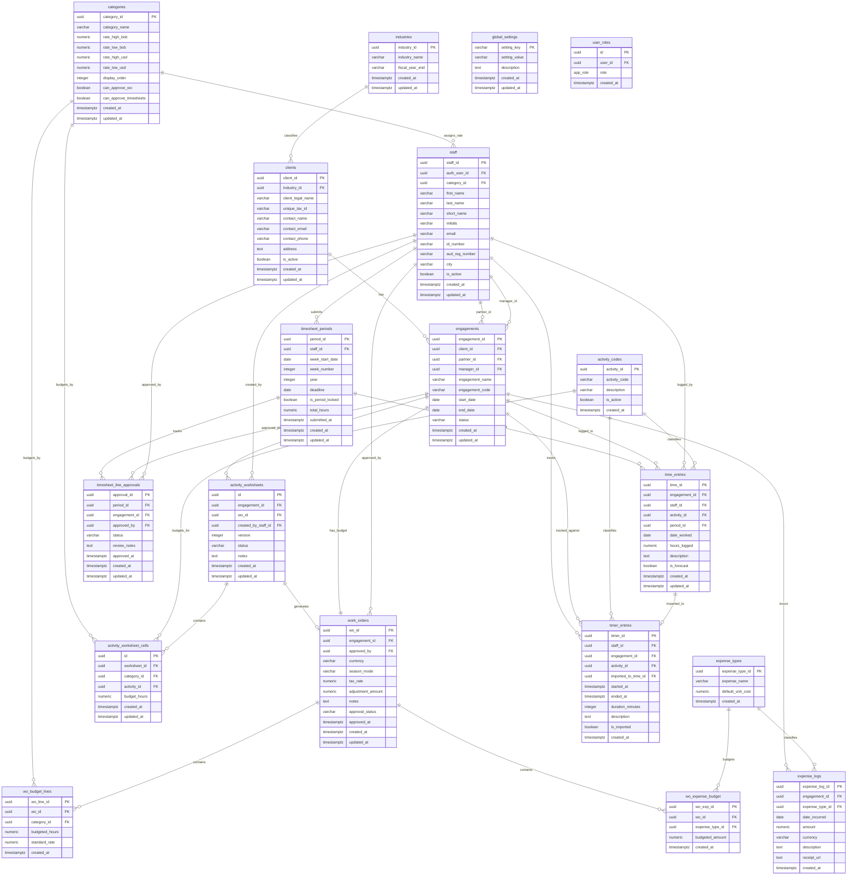

# EMS 2.0 - Engagement Management System

A comprehensive bilingual (English/Spanish) engagement management system designed for professional services firms, particularly accounting and consulting practices. Built on the Ruizmier brand identity.

   

## 🎯 Overview

EMS 2.0 manages the complete lifecycle of professional engagements from client onboarding through work order budgeting, time tracking, and expense management. The system supports multi-currency operations (USD/BOB) with seasonal rate variations.

## ✨ Key Features

### Core Modules

| Module          | Description                                                           |
| --------------- | --------------------------------------------------------------------- |
| **Dashboard**   | Overview of active engagements, hours logged, and key metrics         |
| **Clients**     | Client management with industry classification and engagement history |
| **Engagements** | Engagement lifecycle with partner/manager assignments                 |
| **Work Orders** | Budget management with multi-currency and seasonal rates              |
| **Time Entry**  | Hour logging with daily/weekly limit enforcement                      |
| **Expenses**    | Expense type configuration and expense logging                        |
| **Staff**       | Staff management with category-based roles and rates                  |
| **Settings**    | System configuration (categories, industries, activity codes)         |

### Business Logic

- **Multi-Currency Support**: USD and BOB with automatic rate selection
- **Seasonal Rates**: High and Low season rate differentiation per category
- **Realization Calculation**: Adjustment amount affects rates, preserves hours
- **Approval Workflow**: Draft → Pending Approval → Approved/Rejected
- **Time Constraints**: 10-hour daily limit, 50-hour weekly limit
- **Role-Based Approvals**: Category-level `can_approve_wo` designation

### Internationalization

- Full English and Spanish language support
- Language setting stored in Global Settings (admin-configurable)
- Date format: DD/MM/YYYY throughout

## 🏗️ Technical Architecture

### Frontend Stack

- **React 18** with TypeScript
- **Vite** for fast development and building
- **Tailwind CSS** with custom design tokens
- **shadcn/ui** component library
- **TanStack Query** for server state management
- **react-hook-form** + **Zod** for form handling
- **react-i18next** for internationalization

### Backend Stack

- **Lovable Cloud** (Supabase-powered)
- PostgreSQL database with RLS policies
- Row Level Security for data protection
- Database functions and triggers for validation

### Design System

- **Primary Teal**: #008795
- **Secondary Navy**: #0f3c73
- **Typography**: IBM Plex Sans with tabular figures
- **Density**: High-density, spreadsheet-like interfaces
- **Theme**: Corporate fintech aesthetic

### Vite Dependency Optimization

This project uses proactive dependency pre-bundling to prevent 504 Gateway Timeout errors in the Lovable sandbox environment.

#### Why This Matters

Heavy dependencies (large bundles, locale sub-modules, monorepo packages) can cause Vite's dev server to timeout during on-demand pre-bundling, resulting in blank pages and React hydration errors.

#### Pre-Bundled Dependencies

The following are explicitly included in `vite.config.ts` → `optimizeDeps.include`:

| Category            | Packages                                                                                 |
| ------------------- | ---------------------------------------------------------------------------------------- |
| Date/Time           | `date-fns`, `date-fns/locale`                                                            |
| Visualization       | `recharts`                                                                               |
| i18n                | `i18next`, `react-i18next`                                                               |
| Radix UI (Critical) | `@radix-ui/react-dialog`, `react-select`, `react-popover`, `react-tooltip`, `react-slot` |

#### Decision Rule: When to Add New Dependencies

Add a package to `optimizeDeps.include` if **ANY** of these apply:

- Package size > 500KB (check on [bundlephobia.com](https://bundlephobia.com))
- Has locale/language sub-modules (e.g., `/locale/`)
- Uses deep imports (e.g., `from 'pkg/submodule'`)
- Is a monorepo package (e.g., `@scope/*`)
- Provides CommonJS + ESM hybrid
- Previously caused loading issues

#### Debugging Symptoms

| Symptom                        | Location    | Indicates                           |
| ------------------------------ | ----------- | ----------------------------------- |
| 504/502 on `.vite/deps/*`      | Network Tab | Pre-bundling timeout                |
| `Failed to load module script` | Console     | Module resolution failure           |
| `React error #418`             | Console     | Hydration crash from missing module |
| Blank white page               | Preview     | Complete app failure                |

#### Recovery Steps

1. Add the failing dependency to `optimizeDeps.include` in `vite.config.ts`
2. Force cache rebuild (add/modify comment in config)
3. Hard refresh (`Ctrl+Shift+R` / `Cmd+Shift+R`)

## 📊 Database Schema (Updated 2512110240)

```sql
-- =============================================
-- EMS 2.0 DATABASE SCHEMA - COMPLETE
-- =============================================

-- ============================================
-- ENUMS
-- ============================================
CREATE TYPE public.app_role AS ENUM ('admin', 'staff', 'viewer');

-- ============================================
-- 1. GLOBAL_SETTINGS - System-wide configuration
-- ============================================
CREATE TABLE public.global_settings (
  setting_key VARCHAR(100) PRIMARY KEY,
  setting_value VARCHAR(255) NOT NULL,
  description TEXT,
  created_at TIMESTAMP WITH TIME ZONE DEFAULT NOW(),
  updated_at TIMESTAMP WITH TIME ZONE DEFAULT NOW()
);

-- ============================================
-- 2. INDUSTRIES - Industry definitions with fiscal year end
-- ============================================
CREATE TABLE public.industries (
  industry_id UUID PRIMARY KEY DEFAULT gen_random_uuid(),
  industry_name VARCHAR(100) NOT NULL UNIQUE,
  fiscal_year_end VARCHAR(50) NOT NULL,
  created_at TIMESTAMP WITH TIME ZONE DEFAULT NOW(),
  updated_at TIMESTAMP WITH TIME ZONE DEFAULT NOW()
);

-- ============================================
-- 3. CATEGORIES - Staff categories with seasonal/currency rates
-- ============================================
CREATE TABLE public.categories (
  category_id UUID PRIMARY KEY DEFAULT gen_random_uuid(),
  category_name VARCHAR(50) NOT NULL UNIQUE,
  rate_high_bob DECIMAL(10,2) NOT NULL DEFAULT 0,
  rate_low_bob DECIMAL(10,2) NOT NULL DEFAULT 0,
  rate_high_usd DECIMAL(10,2) NOT NULL DEFAULT 0,
  rate_low_usd DECIMAL(10,2) NOT NULL DEFAULT 0,
  display_order INTEGER DEFAULT 0,
  can_approve_wo BOOLEAN DEFAULT false,
  can_approve_timesheets BOOLEAN DEFAULT false,
  created_at TIMESTAMP WITH TIME ZONE DEFAULT NOW(),
  updated_at TIMESTAMP WITH TIME ZONE DEFAULT NOW()
);

-- ============================================
-- 4. ACTIVITY_CODES - Time tracking activity types
-- ============================================
CREATE TABLE public.activity_codes (
  activity_id UUID PRIMARY KEY DEFAULT gen_random_uuid(),
  activity_code VARCHAR(10) NOT NULL UNIQUE,
  description VARCHAR(100) NOT NULL,
  default_category_id UUID REFERENCES public.categories(category_id),
  is_active BOOLEAN DEFAULT TRUE,
  created_at TIMESTAMP WITH TIME ZONE DEFAULT NOW()
);

-- ============================================
-- 5. EXPENSE_TYPES - Expense categories
-- ============================================
CREATE TABLE public.expense_types (
  expense_type_id UUID PRIMARY KEY DEFAULT gen_random_uuid(),
  expense_name VARCHAR(100) NOT NULL UNIQUE,
  default_unit_cost DECIMAL(10,2) DEFAULT 0,
  created_at TIMESTAMP WITH TIME ZONE DEFAULT NOW()
);

-- ============================================
-- 6. USER_ROLES - User role assignments
-- ============================================
CREATE TABLE public.user_roles (
  id UUID PRIMARY KEY DEFAULT gen_random_uuid(),
  user_id UUID REFERENCES auth.users(id) ON DELETE CASCADE NOT NULL,
  role app_role NOT NULL DEFAULT 'staff',
  created_at TIMESTAMP WITH TIME ZONE DEFAULT NOW(),
  UNIQUE (user_id, role)
);

-- ============================================
-- 7. STAFF - Staff members (links to auth.users)
-- ============================================
CREATE TABLE public.staff (
  staff_id UUID PRIMARY KEY DEFAULT gen_random_uuid(),
  auth_user_id UUID REFERENCES auth.users(id) ON DELETE SET NULL,
  first_name VARCHAR(100) NOT NULL,
  last_name VARCHAR(100) NOT NULL,
  short_name VARCHAR(50),
  initials VARCHAR(4),
  email VARCHAR(255) UNIQUE,
  category_id UUID REFERENCES public.categories(category_id),
  city VARCHAR CHECK (city IN ('La Paz', 'Santa Cruz')),
  id_number VARCHAR,
  aud_reg_number VARCHAR,
  is_active BOOLEAN DEFAULT TRUE,
  created_at TIMESTAMP WITH TIME ZONE DEFAULT NOW(),
  updated_at TIMESTAMP WITH TIME ZONE DEFAULT NOW()
);

-- ============================================
-- 8. CLIENTS - Client master data
-- ============================================
CREATE TABLE public.clients (
  client_id UUID PRIMARY KEY DEFAULT gen_random_uuid(),
  client_legal_name VARCHAR(255) NOT NULL,
  unique_tax_id VARCHAR(50) NOT NULL UNIQUE,
  industry_id UUID REFERENCES public.industries(industry_id),
  contact_name VARCHAR(200),
  contact_email VARCHAR(255),
  contact_phone VARCHAR(50),
  address TEXT,
  is_active BOOLEAN DEFAULT TRUE,
  created_at TIMESTAMP WITH TIME ZONE DEFAULT NOW(),
  updated_at TIMESTAMP WITH TIME ZONE DEFAULT NOW()
);

-- ============================================
-- 9. ENGAGEMENTS - Engagement/project definitions
-- ============================================
CREATE TABLE public.engagements (
  engagement_id UUID PRIMARY KEY DEFAULT gen_random_uuid(),
  client_id UUID NOT NULL REFERENCES public.clients(client_id) ON DELETE CASCADE,
  engagement_name VARCHAR(255) NOT NULL,
  engagement_code VARCHAR(50),
  partner_id UUID REFERENCES public.staff(staff_id),
  manager_id UUID REFERENCES public.staff(staff_id),
  start_date DATE,
  end_date DATE,
  status VARCHAR(20) DEFAULT 'active' CHECK (status IN ('active', 'pending', 'completed', 'cancelled')),
  created_at TIMESTAMP WITH TIME ZONE DEFAULT NOW(),
  updated_at TIMESTAMP WITH TIME ZONE DEFAULT NOW()
);

-- ============================================
-- 10. WORK_ORDERS - The Budget Engine (1 per Engagement)
-- ============================================
CREATE TABLE public.work_orders (
  wo_id UUID PRIMARY KEY DEFAULT gen_random_uuid(),
  engagement_id UUID NOT NULL UNIQUE REFERENCES public.engagements(engagement_id) ON DELETE CASCADE,
  currency VARCHAR(3) NOT NULL CHECK (currency IN ('USD', 'BOB')),
  season_mode VARCHAR(4) NOT NULL CHECK (season_mode IN ('High', 'Low')),
  tax_rate DECIMAL(5,4) DEFAULT 0.13,
  adjustment_amount DECIMAL(15,2) DEFAULT 0,
  approval_status VARCHAR(20) DEFAULT 'Draft' CHECK (approval_status IN ('Draft', 'Pending_Approval', 'Approved', 'Rejected')),
  approved_by UUID REFERENCES public.staff(staff_id),
  approved_at TIMESTAMP WITH TIME ZONE,
  notes TEXT,
  created_at TIMESTAMP WITH TIME ZONE DEFAULT NOW(),
  updated_at TIMESTAMP WITH TIME ZONE DEFAULT NOW()
);

-- ============================================
-- 11. WO_BUDGET_LINES - Budget line items per category
-- ============================================
CREATE TABLE public.wo_budget_lines (
  wo_line_id UUID PRIMARY KEY DEFAULT gen_random_uuid(),
  wo_id UUID NOT NULL REFERENCES public.work_orders(wo_id) ON DELETE CASCADE,
  category_id UUID NOT NULL REFERENCES public.categories(category_id),
  budgeted_hours DECIMAL(10,2) NOT NULL DEFAULT 0,
  standard_rate DECIMAL(10,2) NOT NULL,
  created_at TIMESTAMP WITH TIME ZONE DEFAULT NOW()
);

-- ============================================
-- 12. WO_EXPENSE_BUDGET - Expense budgets per work order
-- ============================================
CREATE TABLE public.wo_expense_budget (
  wo_exp_id UUID PRIMARY KEY DEFAULT gen_random_uuid(),
  wo_id UUID NOT NULL REFERENCES public.work_orders(wo_id) ON DELETE CASCADE,
  expense_type_id UUID NOT NULL REFERENCES public.expense_types(expense_type_id),
  budgeted_amount DECIMAL(15,2) NOT NULL DEFAULT 0,
  created_at TIMESTAMP WITH TIME ZONE DEFAULT NOW()
);

-- ============================================
-- 13. ACTIVITY_WORKSHEETS - Planning matrices
-- ============================================
CREATE TABLE public.activity_worksheets (
  id UUID PRIMARY KEY DEFAULT gen_random_uuid(),
  engagement_id UUID NOT NULL REFERENCES public.engagements(engagement_id) ON DELETE CASCADE,
  wo_id UUID REFERENCES public.work_orders(wo_id) ON DELETE SET NULL,
  version INTEGER NOT NULL DEFAULT 1,
  status VARCHAR(20) NOT NULL DEFAULT 'draft' CHECK (status IN ('draft', 'approved', 'archived')),
  notes TEXT,
  created_by_staff_id UUID REFERENCES public.staff(staff_id),
  created_at TIMESTAMP WITH TIME ZONE NOT NULL DEFAULT NOW(),
  updated_at TIMESTAMP WITH TIME ZONE NOT NULL DEFAULT NOW(),
  UNIQUE (engagement_id, version)
);

-- ============================================
-- 14. ACTIVITY_WORKSHEET_CELLS - Matrix cells (category x activity)
-- ============================================
CREATE TABLE public.activity_worksheet_cells (
  id UUID PRIMARY KEY DEFAULT gen_random_uuid(),
  worksheet_id UUID NOT NULL REFERENCES public.activity_worksheets(id) ON DELETE CASCADE,
  category_id UUID NOT NULL REFERENCES public.categories(category_id),
  activity_id UUID NOT NULL REFERENCES public.activity_codes(activity_id),
  budget_hours NUMERIC(10,2) NOT NULL DEFAULT 0 CHECK (budget_hours >= 0),
  created_at TIMESTAMP WITH TIME ZONE NOT NULL DEFAULT NOW(),
  updated_at TIMESTAMP WITH TIME ZONE NOT NULL DEFAULT NOW(),
  UNIQUE (worksheet_id, category_id, activity_id)
);

-- ============================================
-- 15. TIMESHEET_PERIODS - Weekly timesheet records
-- ============================================
CREATE TABLE public.timesheet_periods (
  period_id UUID PRIMARY KEY DEFAULT gen_random_uuid(),
  staff_id UUID NOT NULL REFERENCES public.staff(staff_id) ON DELETE CASCADE,
  week_start_date DATE NOT NULL,
  week_number INTEGER NOT NULL,
  year INTEGER NOT NULL,
  deadline DATE,
  is_period_locked BOOLEAN DEFAULT false,
  total_hours NUMERIC(6,2) DEFAULT 0,
  submitted_at TIMESTAMP WITH TIME ZONE,
  created_at TIMESTAMP WITH TIME ZONE DEFAULT NOW(),
  updated_at TIMESTAMP WITH TIME ZONE DEFAULT NOW(),
  UNIQUE(staff_id, week_start_date)
);

-- ============================================
-- 16. TIMESHEET_LINE_APPROVALS - Engagement-level approvals
-- ============================================
CREATE TABLE public.timesheet_line_approvals (
  approval_id UUID PRIMARY KEY DEFAULT gen_random_uuid(),
  period_id UUID NOT NULL REFERENCES public.timesheet_periods(period_id) ON DELETE CASCADE,
  engagement_id UUID NOT NULL REFERENCES public.engagements(engagement_id),
  status VARCHAR NOT NULL DEFAULT 'pending' CHECK (status IN ('pending', 'approved', 'rejected')),
  approved_by UUID REFERENCES public.staff(staff_id),
  approved_at TIMESTAMP WITH TIME ZONE,
  review_notes TEXT,
  created_at TIMESTAMP WITH TIME ZONE DEFAULT NOW(),
  updated_at TIMESTAMP WITH TIME ZONE DEFAULT NOW(),
  UNIQUE(period_id, engagement_id)
);

-- ============================================
-- 17. TIME_ENTRIES - Actual time logged
-- ============================================
CREATE TABLE public.time_entries (
  time_id UUID PRIMARY KEY DEFAULT gen_random_uuid(),
  date_worked DATE NOT NULL,
  hours_logged DECIMAL(4,2) NOT NULL CHECK (hours_logged >= 0),
  staff_id UUID NOT NULL REFERENCES public.staff(staff_id),
  engagement_id UUID NOT NULL REFERENCES public.engagements(engagement_id),
  activity_id UUID NOT NULL REFERENCES public.activity_codes(activity_id),
  period_id UUID REFERENCES public.timesheet_periods(period_id),
  is_forecast BOOLEAN DEFAULT false,
  description TEXT,
  created_at TIMESTAMP WITH TIME ZONE DEFAULT NOW(),
  updated_at TIMESTAMP WITH TIME ZONE DEFAULT NOW()
);

-- ============================================
-- 18. TIMER_ENTRIES - Time tracking staging table
-- ============================================
CREATE TABLE public.timer_entries (
  timer_id UUID NOT NULL DEFAULT gen_random_uuid() PRIMARY KEY,
  staff_id UUID NOT NULL REFERENCES public.staff(staff_id),
  engagement_id UUID NOT NULL REFERENCES public.engagements(engagement_id),
  activity_id UUID NOT NULL REFERENCES public.activity_codes(activity_id),
  description TEXT,
  started_at TIMESTAMP WITH TIME ZONE NOT NULL,
  ended_at TIMESTAMP WITH TIME ZONE,
  duration_minutes INTEGER,
  is_imported BOOLEAN NOT NULL DEFAULT false,
  imported_to_time_id UUID REFERENCES public.time_entries(time_id),
  created_at TIMESTAMP WITH TIME ZONE NOT NULL DEFAULT NOW()
);

-- ============================================
-- 19. EXPENSE_LOGS - Actual expenses incurred
-- ============================================
CREATE TABLE public.expense_logs (
  expense_log_id UUID PRIMARY KEY DEFAULT gen_random_uuid(),
  date_incurred DATE NOT NULL,
  amount DECIMAL(15,2) NOT NULL,
  currency VARCHAR(3) DEFAULT 'BOB' CHECK (currency IN ('USD', 'BOB')),
  engagement_id UUID NOT NULL REFERENCES public.engagements(engagement_id),
  expense_type_id UUID NOT NULL REFERENCES public.expense_types(expense_type_id),
  description TEXT,
  receipt_url TEXT,
  created_at TIMESTAMP WITH TIME ZONE DEFAULT NOW()
);

-- =============================================
-- VIEWS
-- =============================================

-- Work Order Summary View (computed totals)
CREATE VIEW work_order_summary 
WITH (security_invoker = true)
AS
SELECT 
  wo.*,
  COALESCE(SUM(bl.budgeted_hours * bl.standard_rate), 0) as total_standard_fee,
  CASE 
    WHEN COALESCE(SUM(bl.budgeted_hours * bl.standard_rate), 0) > 0 
    THEN (COALESCE(SUM(bl.budgeted_hours * bl.standard_rate), 0) + COALESCE(wo.adjustment_amount, 0)) 
         / COALESCE(SUM(bl.budgeted_hours * bl.standard_rate), 0)
    ELSE 1 
  END as realization_percent,
  (COALESCE(SUM(bl.budgeted_hours * bl.standard_rate), 0) + COALESCE(wo.adjustment_amount, 0)) 
    / (1 - COALESCE(wo.tax_rate, 0.13)) as fee_with_tax_gross_up
FROM work_orders wo
LEFT JOIN wo_budget_lines bl ON wo.wo_id = bl.wo_id
GROUP BY wo.wo_id;

-- Budget Hours by Category and Activity (from worksheet)
CREATE VIEW public.vw_wo_budget_hours_by_category_activity 
WITH (security_invoker = on)
AS
SELECT 
    wo.wo_id,
    wo.engagement_id,
    aw.id AS worksheet_id,
    awc.category_id,
    c.category_name,
    c.display_order AS category_display_order,
    awc.activity_id,
    ac.activity_code,
    ac.description AS activity_description,
    awc.budget_hours
FROM public.work_orders wo
JOIN public.activity_worksheets aw ON aw.wo_id = wo.wo_id
JOIN public.activity_worksheet_cells awc ON awc.worksheet_id = aw.id
JOIN public.categories c ON c.category_id = awc.category_id
JOIN public.activity_codes ac ON ac.activity_id = awc.activity_id
WHERE awc.budget_hours > 0;

-- Budget Hours aggregated by Category
CREATE VIEW public.vw_wo_budget_hours_by_category 
WITH (security_invoker = on)
AS
SELECT 
    wo.wo_id,
    wo.engagement_id,
    awc.category_id,
    c.category_name,
    c.display_order AS category_display_order,
    SUM(awc.budget_hours) AS total_budget_hours
FROM public.work_orders wo
JOIN public.activity_worksheets aw ON aw.wo_id = wo.wo_id
JOIN public.activity_worksheet_cells awc ON awc.worksheet_id = aw.id
JOIN public.categories c ON c.category_id = awc.category_id
WHERE awc.budget_hours > 0
GROUP BY wo.wo_id, wo.engagement_id, awc.category_id, c.category_name, c.display_order;

-- Actual Hours by Category and Activity
CREATE VIEW public.vw_actual_hours_by_category_activity 
WITH (security_invoker = on)
AS
SELECT 
    te.engagement_id,
    s.category_id,
    c.category_name,
    c.display_order AS category_display_order,
    te.activity_id,
    ac.activity_code,
    ac.description AS activity_description,
    SUM(te.hours_logged) AS actual_hours
FROM public.time_entries te
JOIN public.staff s ON s.staff_id = te.staff_id
JOIN public.categories c ON c.category_id = s.category_id
JOIN public.activity_codes ac ON ac.activity_id = te.activity_id
WHERE te.is_forecast = false
GROUP BY te.engagement_id, s.category_id, c.category_name, c.display_order, 
         te.activity_id, ac.activity_code, ac.description;

-- Budget vs Actual Comparison
CREATE VIEW public.vw_budget_vs_actual_hours_by_category_activity 
WITH (security_invoker = on)
AS
SELECT 
    COALESCE(b.wo_id, wo.wo_id) AS wo_id,
    COALESCE(b.engagement_id, a.engagement_id) AS engagement_id,
    COALESCE(b.category_id, a.category_id) AS category_id,
    COALESCE(b.category_name, a.category_name) AS category_name,
    COALESCE(b.category_display_order, a.category_display_order) AS category_display_order,
    COALESCE(b.activity_id, a.activity_id) AS activity_id,
    COALESCE(b.activity_code, a.activity_code) AS activity_code,
    COALESCE(b.activity_description, a.activity_description) AS activity_description,
    COALESCE(b.budget_hours, 0) AS budget_hours,
    COALESCE(a.actual_hours, 0) AS actual_hours,
    COALESCE(b.budget_hours, 0) - COALESCE(a.actual_hours, 0) AS variance_hours
FROM public.vw_wo_budget_hours_by_category_activity b
FULL OUTER JOIN public.vw_actual_hours_by_category_activity a 
    ON b.engagement_id = a.engagement_id 
    AND b.category_id = a.category_id 
    AND b.activity_id = a.activity_id
LEFT JOIN public.work_orders wo ON wo.engagement_id = a.engagement_id;

-- =============================================
-- FUNCTIONS
-- =============================================

-- Update updated_at column
CREATE OR REPLACE FUNCTION public.update_updated_at_column()
RETURNS TRIGGER 
LANGUAGE plpgsql
SECURITY INVOKER
SET search_path = public
AS $$
BEGIN
  NEW.updated_at = NOW();
  RETURN NEW;
END;
$$;

-- Check if user has role
CREATE OR REPLACE FUNCTION public.has_role(_user_id UUID, _role app_role)
RETURNS BOOLEAN
LANGUAGE sql
STABLE
SECURITY DEFINER
SET search_path = public
AS $$
  SELECT EXISTS (
    SELECT 1
    FROM public.user_roles
    WHERE user_id = _user_id
      AND role = _role
  )
$$;

-- Auto-assign 'staff' role on user signup
CREATE OR REPLACE FUNCTION public.handle_new_user()
RETURNS TRIGGER
LANGUAGE plpgsql
SECURITY DEFINER
SET search_path = public
AS $$
BEGIN
  INSERT INTO public.user_roles (user_id, role)
  VALUES (NEW.id, 'staff');
  RETURN NEW;
END;
$$;

-- Link auth user to existing staff by email
CREATE OR REPLACE FUNCTION public.link_auth_user_to_staff()
RETURNS TRIGGER
LANGUAGE plpgsql
SECURITY DEFINER
SET search_path = public
AS $$
BEGIN
  UPDATE public.staff
  SET auth_user_id = NEW.id,
      updated_at = now()
  WHERE email = NEW.email
    AND auth_user_id IS NULL;
  RETURN NEW;
END;
$$;

-- Check if work order is approved before time entry
CREATE OR REPLACE FUNCTION check_wo_approved()
RETURNS TRIGGER 
LANGUAGE plpgsql 
SECURITY DEFINER 
SET search_path = public
AS $$
BEGIN
  IF NOT EXISTS (
    SELECT 1 FROM work_orders wo
    WHERE wo.engagement_id = NEW.engagement_id
    AND wo.approval_status = 'Approved'
  ) THEN
    RAISE EXCEPTION 'Cannot log time: Work Order is not approved';
  END IF;
  RETURN NEW;
END;
$$;

-- Check if staff category is auto-approved (Partner/Director)
CREATE OR REPLACE FUNCTION public.is_auto_approved_category(p_staff_id UUID)
RETURNS boolean
LANGUAGE sql
STABLE
SECURITY DEFINER
SET search_path = public
AS $$
  SELECT EXISTS (
    SELECT 1
    FROM staff s
    JOIN categories c ON s.category_id = c.category_id
    WHERE s.staff_id = p_staff_id
      AND c.display_order <= 2
  )
$$;

-- Get valid timesheet approvers for a staff member and week
CREATE OR REPLACE FUNCTION public.get_timesheet_approvers(p_staff_id UUID, p_week_start DATE)
RETURNS TABLE(approver_staff_id UUID)
LANGUAGE plpgsql
STABLE
SECURITY DEFINER
SET search_path = public
AS $$
DECLARE
  v_submitter_display_order INTEGER;
BEGIN
  SELECT c.display_order INTO v_submitter_display_order
  FROM staff s
  JOIN categories c ON s.category_id = c.category_id
  WHERE s.staff_id = p_staff_id;

  IF v_submitter_display_order IS NULL THEN
    RETURN;
  END IF;

  RETURN QUERY
  SELECT DISTINCT potential_approver.staff_id
  FROM (
    SELECT e.manager_id AS staff_id
    FROM time_entries te
    JOIN engagements e ON te.engagement_id = e.engagement_id
    WHERE te.staff_id = p_staff_id
      AND te.date_worked >= p_week_start
      AND te.date_worked < p_week_start + INTERVAL '7 days'
      AND e.manager_id IS NOT NULL
    
    UNION
    
    SELECT e.partner_id AS staff_id
    FROM time_entries te
    JOIN engagements e ON te.engagement_id = e.engagement_id
    WHERE te.staff_id = p_staff_id
      AND te.date_worked >= p_week_start
      AND te.date_worked < p_week_start + INTERVAL '7 days'
      AND e.partner_id IS NOT NULL
  ) potential_approver
  JOIN staff approver_s ON potential_approver.staff_id = approver_s.staff_id
  JOIN categories approver_c ON approver_s.category_id = approver_c.category_id
  WHERE potential_approver.staff_id != p_staff_id
    AND approver_c.display_order < v_submitter_display_order
    AND approver_c.can_approve_timesheets = true;
END;
$$;

-- Check if user can approve a specific timesheet period
CREATE OR REPLACE FUNCTION public.can_approve_timesheet(p_approver_auth_id UUID, p_period_id UUID)
RETURNS boolean
LANGUAGE plpgsql
STABLE
SECURITY DEFINER
SET search_path = public
AS $$
DECLARE
  v_period RECORD;
  v_approver_staff_id UUID;
BEGIN
  SELECT staff_id INTO v_approver_staff_id
  FROM staff
  WHERE auth_user_id = p_approver_auth_id;

  IF v_approver_staff_id IS NULL THEN
    RETURN false;
  END IF;

  SELECT tp.staff_id, tp.week_start_date
  INTO v_period
  FROM timesheet_periods tp
  WHERE tp.period_id = p_period_id;

  IF v_period IS NULL THEN
    RETURN false;
  END IF;

  RETURN EXISTS (
    SELECT 1 
    FROM get_timesheet_approvers(v_period.staff_id, v_period.week_start_date) gta
    WHERE gta.approver_staff_id = v_approver_staff_id
  );
END;
$$;

-- Get line approver for engagement-level approval
CREATE OR REPLACE FUNCTION public.get_line_approver(p_staff_id UUID, p_engagement_id UUID)
RETURNS UUID
LANGUAGE plpgsql
STABLE
SECURITY DEFINER
SET search_path = public
AS $$
DECLARE
  v_staff_display_order INTEGER;
  v_engagement RECORD;
BEGIN
  SELECT c.display_order INTO v_staff_display_order
  FROM staff s
  JOIN categories c ON s.category_id = c.category_id
  WHERE s.staff_id = p_staff_id;

  IF v_staff_display_order IS NOT NULL AND v_staff_display_order <= 2 THEN
    RETURN NULL;
  END IF;

  SELECT manager_id, partner_id INTO v_engagement
  FROM engagements
  WHERE engagement_id = p_engagement_id;

  IF v_staff_display_order IS NOT NULL AND v_staff_display_order <= 4 THEN
    RETURN v_engagement.partner_id;
  END IF;

  IF v_engagement.manager_id IS NOT NULL THEN
    RETURN v_engagement.manager_id;
  END IF;

  RETURN v_engagement.partner_id;
END;
$$;

-- Check if user can approve a specific timesheet line
CREATE OR REPLACE FUNCTION public.can_approve_timesheet_line(
  p_approver_auth_id UUID, 
  p_period_id UUID, 
  p_engagement_id UUID
)
RETURNS BOOLEAN
LANGUAGE plpgsql
STABLE
SECURITY DEFINER
SET search_path = public
AS $$
DECLARE
  v_approver_staff_id UUID;
  v_period_staff_id UUID;
  v_expected_approver UUID;
  v_approver_display_order INTEGER;
BEGIN
  SELECT staff_id INTO v_approver_staff_id
  FROM staff
  WHERE auth_user_id = p_approver_auth_id;

  IF v_approver_staff_id IS NULL THEN
    RETURN FALSE;
  END IF;

  SELECT c.display_order INTO v_approver_display_order
  FROM staff s
  JOIN categories c ON s.category_id = c.category_id
  WHERE s.staff_id = v_approver_staff_id
    AND c.can_approve_timesheets = TRUE;

  IF v_approver_display_order IS NULL THEN
    RETURN FALSE;
  END IF;

  SELECT staff_id INTO v_period_staff_id
  FROM timesheet_periods
  WHERE period_id = p_period_id;

  IF v_period_staff_id IS NULL THEN
    RETURN FALSE;
  END IF;

  IF v_approver_staff_id = v_period_staff_id THEN
    RETURN FALSE;
  END IF;

  v_expected_approver := get_line_approver(v_period_staff_id, p_engagement_id);

  IF v_expected_approver IS NULL THEN
    RETURN FALSE;
  END IF;

  RETURN v_approver_staff_id = v_expected_approver
    OR v_approver_display_order < (
      SELECT c.display_order 
      FROM staff s 
      JOIN categories c ON s.category_id = c.category_id 
      WHERE s.staff_id = v_expected_approver
    );
END;
$$;

-- Sync worksheet to wo_budget_lines
CREATE OR REPLACE FUNCTION public.sync_worksheet_to_wo_budget(
    p_worksheet_id UUID,
    p_wo_id UUID
)
RETURNS VOID
LANGUAGE plpgsql
SECURITY DEFINER
SET search_path = public
AS $$
DECLARE
    v_wo RECORD;
BEGIN
    SELECT wo_id, currency, season_mode INTO v_wo
    FROM work_orders
    WHERE wo_id = p_wo_id;

    IF v_wo IS NULL THEN
        RAISE EXCEPTION 'Work order not found: %', p_wo_id;
    END IF;

    UPDATE activity_worksheets
    SET wo_id = p_wo_id, updated_at = now()
    WHERE id = p_worksheet_id;

    DELETE FROM wo_budget_lines WHERE wo_id = p_wo_id;

    INSERT INTO wo_budget_lines (wo_id, category_id, budgeted_hours, standard_rate)
    SELECT 
        p_wo_id,
        awc.category_id,
        SUM(awc.budget_hours),
        CASE 
            WHEN v_wo.currency = 'USD' AND v_wo.season_mode = 'High' THEN c.rate_high_usd
            WHEN v_wo.currency = 'USD' AND v_wo.season_mode = 'Low' THEN c.rate_low_usd
            WHEN v_wo.currency = 'BOB' AND v_wo.season_mode = 'High' THEN c.rate_high_bob
            ELSE c.rate_low_bob
        END
    FROM activity_worksheet_cells awc
    JOIN categories c ON c.category_id = awc.category_id
    WHERE awc.worksheet_id = p_worksheet_id
      AND awc.budget_hours > 0
    GROUP BY awc.category_id, c.rate_high_usd, c.rate_low_usd, c.rate_high_bob, c.rate_low_bob;
END;
$$;

-- =============================================
-- TRIGGERS
-- =============================================

-- Auto-update updated_at
CREATE TRIGGER update_global_settings_updated_at BEFORE UPDATE ON public.global_settings FOR EACH ROW EXECUTE FUNCTION public.update_updated_at_column();
CREATE TRIGGER update_industries_updated_at BEFORE UPDATE ON public.industries FOR EACH ROW EXECUTE FUNCTION public.update_updated_at_column();
CREATE TRIGGER update_categories_updated_at BEFORE UPDATE ON public.categories FOR EACH ROW EXECUTE FUNCTION public.update_updated_at_column();
CREATE TRIGGER update_staff_updated_at BEFORE UPDATE ON public.staff FOR EACH ROW EXECUTE FUNCTION public.update_updated_at_column();
CREATE TRIGGER update_clients_updated_at BEFORE UPDATE ON public.clients FOR EACH ROW EXECUTE FUNCTION public.update_updated_at_column();
CREATE TRIGGER update_engagements_updated_at BEFORE UPDATE ON public.engagements FOR EACH ROW EXECUTE FUNCTION public.update_updated_at_column();
CREATE TRIGGER update_work_orders_updated_at BEFORE UPDATE ON public.work_orders FOR EACH ROW EXECUTE FUNCTION public.update_updated_at_column();
CREATE TRIGGER update_time_entries_updated_at BEFORE UPDATE ON public.time_entries FOR EACH ROW EXECUTE FUNCTION public.update_updated_at_column();
CREATE TRIGGER update_timesheet_periods_updated_at BEFORE UPDATE ON public.timesheet_periods FOR EACH ROW EXECUTE FUNCTION public.update_updated_at_column();
CREATE TRIGGER update_timesheet_line_approvals_updated_at BEFORE UPDATE ON public.timesheet_line_approvals FOR EACH ROW EXECUTE FUNCTION public.update_updated_at_column();
CREATE TRIGGER update_activity_worksheets_updated_at BEFORE UPDATE ON public.activity_worksheets FOR EACH ROW EXECUTE FUNCTION public.update_updated_at_column();
CREATE TRIGGER update_activity_worksheet_cells_updated_at BEFORE UPDATE ON public.activity_worksheet_cells FOR EACH ROW EXECUTE FUNCTION public.update_updated_at_column();

-- Auth user triggers
CREATE TRIGGER on_auth_user_created AFTER INSERT ON auth.users FOR EACH ROW EXECUTE FUNCTION public.handle_new_user();
CREATE TRIGGER on_auth_user_created_link_staff AFTER INSERT ON auth.users FOR EACH ROW EXECUTE FUNCTION public.link_auth_user_to_staff();

-- Work order approval enforcement
CREATE TRIGGER enforce_wo_approval BEFORE INSERT ON time_entries FOR EACH ROW EXECUTE FUNCTION check_wo_approved();

-- =============================================
-- INDEXES
-- =============================================
CREATE INDEX idx_timesheet_periods_staff_date ON public.timesheet_periods(staff_id, week_start_date);
CREATE INDEX idx_timesheet_periods_status ON public.timesheet_periods(status);
CREATE INDEX idx_timesheet_periods_deadline ON public.timesheet_periods(deadline);
CREATE INDEX idx_time_entries_period ON public.time_entries(period_id);
CREATE INDEX idx_timer_entries_staff_id ON public.timer_entries(staff_id);
CREATE INDEX idx_timer_entries_started_at ON public.timer_entries(started_at);
CREATE INDEX idx_timer_entries_is_imported ON public.timer_entries(is_imported);
CREATE INDEX idx_activity_worksheets_engagement ON public.activity_worksheets(engagement_id);
CREATE INDEX idx_activity_worksheets_wo ON public.activity_worksheets(wo_id);
CREATE INDEX idx_activity_worksheet_cells_worksheet ON public.activity_worksheet_cells(worksheet_id);
CREATE INDEX idx_activity_worksheet_cells_category ON public.activity_worksheet_cells(category_id);
CREATE INDEX idx_activity_worksheet_cells_activity ON public.activity_worksheet_cells(activity_id);

-- =============================================
-- ENABLE ROW LEVEL SECURITY
-- =============================================
ALTER TABLE public.global_settings ENABLE ROW LEVEL SECURITY;
ALTER TABLE public.industries ENABLE ROW LEVEL SECURITY;
ALTER TABLE public.categories ENABLE ROW LEVEL SECURITY;
ALTER TABLE public.activity_codes ENABLE ROW LEVEL SECURITY;
ALTER TABLE public.expense_types ENABLE ROW LEVEL SECURITY;
ALTER TABLE public.user_roles ENABLE ROW LEVEL SECURITY;
ALTER TABLE public.staff ENABLE ROW LEVEL SECURITY;
ALTER TABLE public.clients ENABLE ROW LEVEL SECURITY;
ALTER TABLE public.engagements ENABLE ROW LEVEL SECURITY;
ALTER TABLE public.work_orders ENABLE ROW LEVEL SECURITY;
ALTER TABLE public.wo_budget_lines ENABLE ROW LEVEL SECURITY;
ALTER TABLE public.wo_expense_budget ENABLE ROW LEVEL SECURITY;
ALTER TABLE public.time_entries ENABLE ROW LEVEL SECURITY;
ALTER TABLE public.timer_entries ENABLE ROW LEVEL SECURITY;
ALTER TABLE public.expense_logs ENABLE ROW LEVEL SECURITY;
ALTER TABLE public.timesheet_periods ENABLE ROW LEVEL SECURITY;
ALTER TABLE public.timesheet_line_approvals ENABLE ROW LEVEL SECURITY;
ALTER TABLE public.activity_worksheets ENABLE ROW LEVEL SECURITY;
ALTER TABLE public.activity_worksheet_cells ENABLE ROW LEVEL SECURITY;

-- =============================================
-- RLS POLICIES (50 total)
-- =============================================

-- Global Settings
CREATE POLICY "Authenticated users can read settings" ON public.global_settings FOR SELECT TO authenticated USING (true);
CREATE POLICY "Authenticated users can manage settings" ON public.global_settings FOR ALL TO authenticated USING (true) WITH CHECK (true);

-- Industries
CREATE POLICY "Authenticated users can read industries" ON public.industries FOR SELECT TO authenticated USING (true);
CREATE POLICY "Authenticated users can manage industries" ON public.industries FOR ALL TO authenticated USING (true) WITH CHECK (true);

-- Categories
CREATE POLICY "Authenticated users can read categories" ON public.categories FOR SELECT TO authenticated USING (true);
CREATE POLICY "Authenticated users can manage categories" ON public.categories FOR ALL TO authenticated USING (true) WITH CHECK (true);

-- Activity Codes
CREATE POLICY "Authenticated users can read activities" ON public.activity_codes FOR SELECT TO authenticated USING (true);
CREATE POLICY "Authenticated users can manage activities" ON public.activity_codes FOR ALL TO authenticated USING (true) WITH CHECK (true);

-- Expense Types
CREATE POLICY "Authenticated users can read expense types" ON public.expense_types FOR SELECT TO authenticated USING (true);
CREATE POLICY "Authenticated users can manage expense types" ON public.expense_types FOR ALL TO authenticated USING (true) WITH CHECK (true);

-- User Roles
CREATE POLICY "Users can view their own roles" ON public.user_roles FOR SELECT USING (auth.uid() = user_id);
CREATE POLICY "Admins can manage all roles" ON public.user_roles FOR ALL USING (public.has_role(auth.uid(), 'admin')) WITH CHECK (public.has_role(auth.uid(), 'admin'));

-- Staff
CREATE POLICY "Authenticated users can read staff" ON public.staff FOR SELECT TO authenticated USING (true);
CREATE POLICY "Authenticated users can manage staff" ON public.staff FOR ALL TO authenticated USING (true) WITH CHECK (true);
CREATE POLICY "Users can view their linked staff record" ON public.staff FOR SELECT USING (auth_user_id = auth.uid());
CREATE POLICY "Users can update their linked staff record" ON public.staff FOR UPDATE USING (auth_user_id = auth.uid()) WITH CHECK (auth_user_id = auth.uid());

-- Clients
CREATE POLICY "Authenticated users can read clients" ON public.clients FOR SELECT TO authenticated USING (true);
CREATE POLICY "Authenticated users can manage clients" ON public.clients FOR ALL TO authenticated USING (true) WITH CHECK (true);

-- Engagements
CREATE POLICY "Authenticated users can read engagements" ON public.engagements FOR SELECT TO authenticated USING (true);
CREATE POLICY "Authenticated users can manage engagements" ON public.engagements FOR ALL TO authenticated USING (true) WITH CHECK (true);

-- Work Orders
CREATE POLICY "Authenticated users can read work orders" ON public.work_orders FOR SELECT TO authenticated USING (true);
CREATE POLICY "Authenticated users can manage work orders" ON public.work_orders FOR ALL TO authenticated USING (true) WITH CHECK (true);

-- WO Budget Lines
CREATE POLICY "Authenticated users can read budget lines" ON public.wo_budget_lines FOR SELECT TO authenticated USING (true);
CREATE POLICY "Authenticated users can manage budget lines" ON public.wo_budget_lines FOR ALL TO authenticated USING (true) WITH CHECK (true);

-- WO Expense Budget
CREATE POLICY "Authenticated users can read expense budget" ON public.wo_expense_budget FOR SELECT TO authenticated USING (true);
CREATE POLICY "Authenticated users can manage expense budget" ON public.wo_expense_budget FOR ALL TO authenticated USING (true) WITH CHECK (true);

-- Time Entries
CREATE POLICY "Authenticated users can read time entries" ON public.time_entries FOR SELECT TO authenticated USING (true);
CREATE POLICY "Authenticated users can manage time entries" ON public.time_entries FOR ALL TO authenticated USING (true) WITH CHECK (true);

-- Timer Entries
CREATE POLICY "Staff can view own timer entries" ON public.timer_entries FOR SELECT USING (staff_id IN (SELECT s.staff_id FROM staff s WHERE s.auth_user_id = auth.uid()));
CREATE POLICY "Staff can create own timer entries" ON public.timer_entries FOR INSERT WITH CHECK (staff_id IN (SELECT s.staff_id FROM staff s WHERE s.auth_user_id = auth.uid()));
CREATE POLICY "Staff can update own timer entries" ON public.timer_entries FOR UPDATE USING (staff_id IN (SELECT s.staff_id FROM staff s WHERE s.auth_user_id = auth.uid()));
CREATE POLICY "Staff can delete own timer entries" ON public.timer_entries FOR DELETE USING (staff_id IN (SELECT s.staff_id FROM staff s WHERE s.auth_user_id = auth.uid()));

-- Expense Logs
CREATE POLICY "Authenticated users can read expense logs" ON public.expense_logs FOR SELECT TO authenticated USING (true);
CREATE POLICY "Authenticated users can manage expense logs" ON public.expense_logs FOR ALL TO authenticated USING (true) WITH CHECK (true);

-- Timesheet Periods
CREATE POLICY "Staff can view own periods" ON public.timesheet_periods FOR SELECT USING (staff_id IN (SELECT s.staff_id FROM public.staff s WHERE s.auth_user_id = auth.uid()));
CREATE POLICY "Staff can create own periods" ON public.timesheet_periods FOR INSERT WITH CHECK (staff_id IN (SELECT s.staff_id FROM public.staff s WHERE s.auth_user_id = auth.uid()));
CREATE POLICY "Staff can update own unlocked periods" ON public.timesheet_periods FOR UPDATE USING (staff_id IN (SELECT s.staff_id FROM public.staff s WHERE s.auth_user_id = auth.uid()) AND is_period_locked = false);
CREATE POLICY "Approvers can view all periods" ON public.timesheet_periods FOR SELECT USING (EXISTS (SELECT 1 FROM public.staff s JOIN public.categories c ON s.category_id = c.category_id WHERE s.auth_user_id = auth.uid() AND c.can_approve_wo = true));
CREATE POLICY "Approvers can update all periods" ON public.timesheet_periods FOR UPDATE USING (EXISTS (SELECT 1 FROM public.staff s JOIN public.categories c ON s.category_id = c.category_id WHERE s.auth_user_id = auth.uid() AND c.can_approve_wo = true));
CREATE POLICY "Approvers can view assigned timesheets" ON public.timesheet_periods FOR SELECT USING (can_approve_timesheet(auth.uid(), period_id));
CREATE POLICY "Approvers can update assigned timesheets" ON public.timesheet_periods FOR UPDATE USING (can_approve_timesheet(auth.uid(), period_id));

-- Timesheet Line Approvals
CREATE POLICY "Staff can view own line approvals" ON public.timesheet_line_approvals FOR SELECT USING (period_id IN (SELECT tp.period_id FROM timesheet_periods tp JOIN staff s ON tp.staff_id = s.staff_id WHERE s.auth_user_id = auth.uid()));
CREATE POLICY "Staff can create own line approvals" ON public.timesheet_line_approvals FOR INSERT WITH CHECK (period_id IN (SELECT tp.period_id FROM timesheet_periods tp JOIN staff s ON tp.staff_id = s.staff_id WHERE s.auth_user_id = auth.uid()));
CREATE POLICY "Approvers can view assigned line approvals" ON public.timesheet_line_approvals FOR SELECT USING (can_approve_timesheet_line(auth.uid(), period_id, engagement_id));
CREATE POLICY "Approvers can update assigned line approvals" ON public.timesheet_line_approvals FOR UPDATE USING (can_approve_timesheet_line(auth.uid(), period_id, engagement_id));
CREATE POLICY "Leadership can view all line approvals" ON public.timesheet_line_approvals FOR SELECT USING (EXISTS (SELECT 1 FROM staff s JOIN categories c ON s.category_id = c.category_id WHERE s.auth_user_id = auth.uid() AND c.display_order <= 2));

-- Activity Worksheets
CREATE POLICY "Authenticated users can read worksheets" ON public.activity_worksheets FOR SELECT USING (true);
CREATE POLICY "Authenticated users can manage worksheets" ON public.activity_worksheets FOR ALL USING (true) WITH CHECK (true);

-- Activity Worksheet Cells
CREATE POLICY "Authenticated users can read worksheet cells" ON public.activity_worksheet_cells FOR SELECT USING (true);
CREATE POLICY "Authenticated users can manage worksheet cells" ON public.activity_worksheet_cells FOR ALL USING (true) WITH CHECK (true);


```

⸻

## 📊 Database Table Summary

| Table                      | Purpose                                                 | Key Relationships                                               |
| -------------------------- | ------------------------------------------------------- | --------------------------------------------------------------- |
| `industries`               | Client industry classification                          | → `clients`                                                     |
| `categories`               | Staff categories with billing rates                     | → `staff`, `wo_budget_lines`, `activity_worksheet_cells`        |
| `activity_codes`           | Time entry classification codes                         | → `time_entries`, `timer_entries`, `activity_worksheet_cells`   |
| `expense_types`            | Expense classification                                  | → `expense_logs`, `wo_expense_budget`                           |
| `global_settings`          | System configuration values (`TAX_RATE`, etc.)          | None                                                            |
| `user_roles`               | Authentication roles (`admin`, `staff`, `viewer`)       | → `auth.users`                                                  |
| `staff`                    | Employee records                                        | → `categories`, `auth.users`                                    |
| `clients`                  | Client companies                                        | → `industries`                                                  |
| `engagements`              | Projects / Jobs                                         | → `clients`, `staff` (partner, manager)                         |
| `activity_worksheets`      | Budget planning matrix per engagement                   | → `engagements`, `work_orders`, `staff` (creator)               |
| `activity_worksheet_cells` | Individual budget cells (category × activity)           | → `activity_worksheets`, `categories`, `activity_codes`         |
| `work_orders`              | Engagement pricing & budget (strict 1:1 per engagement) | → `engagements`, `staff` (approver)                             |
| `wo_budget_lines`          | Hours budget by category (aggregated from worksheet)    | → `work_orders`, `categories`                                   |
| `wo_expense_budget`        | Expense budget allocations                              | → `work_orders`, `expense_types`                                |
| `timesheet_periods`        | Weekly timesheet headers (submission status)            | → `staff`                                                       |
| `timesheet_line_approvals` | Per-engagement approval status within a period          | → `timesheet_periods`, `engagements`, `staff` (approver)        |
| `time_entries`             | Actual hours logged                                     | → `engagements`, `staff`, `activity_codes`, `timesheet_periods` |
| `timer_entries`            | Real-time stopwatch staging table                       | → `staff`, `engagements`, `activity_codes`, `time_entries`      |
| `expense_logs`             | Expenses incurred by engagement                         | → `engagements`, `expense_types`                                |

### 🎯 Notes

#### 🔗 Work Order Structure

- `work_orders` enforce a strict **1:1 relationship with engagements**, functioning like a **pricing & budget sheet**

#### 👥 Staff Relationships

Staff has multiple functional relationships:

- Associated with **categories** (rate group)
- Linked to **Supabase \`auth.users\`**
- Assigned as **partner/manager in engagements**

#### 📌 Supported Business Logic

This schema supports:

- Seasonality-based pricing
- Multi-currency budget planning (**BOB/USD**)
- Category-level time budgeting
- Expense forecasting

⸻

## 📊 Entity Relationship Diagram



### Diagram Notes

| Symbol       | Meaning                                      |
| ------------ | -------------------------------------------- |
| `\|\|--\|\|` | One-to-One (e.g., engagement ↔ work_order)  |
| `\|\|--o{`   | One-to-Many (e.g., client → engagements)     |
| `o\|`        | Zero-or-One (e.g., timer_entry → time_entry) |
| `PK`         | Primary Key                                  |
| `FK`         | Foreign Key                                  |

## More Stuff
