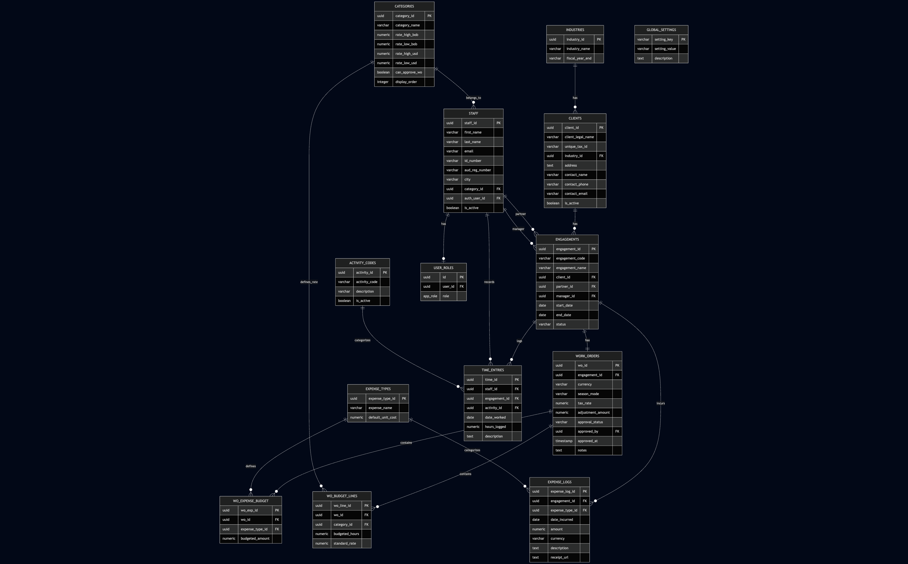

# EMS 2.0 - Engagement Management System

A comprehensive bilingual (English/Spanish) engagement management system designed for professional services firms, particularly accounting and consulting practices. Built on the Ruizmier brand identity.

   

## 🎯 Overview

EMS 2.0 manages the complete lifecycle of professional engagements from client onboarding through work order budgeting, time tracking, and expense management. The system supports multi-currency operations (USD/BOB) with seasonal rate variations.

## ✨ Key Features

### Core Modules
| Module | Description |
|--------|-------------|
| **Dashboard** | Overview of active engagements, hours logged, and key metrics |
| **Clients** | Client management with industry classification and engagement history |
| **Engagements** | Engagement lifecycle with partner/manager assignments |
| **Work Orders** | Budget management with multi-currency and seasonal rates |
| **Time Entry** | Hour logging with daily/weekly limit enforcement |
| **Expenses** | Expense type configuration and expense logging |
| **Staff** | Staff management with category-based roles and rates |
| **Settings** | System configuration (categories, industries, activity codes) |

### Business Logic
- **Multi-Currency Support**: USD and BOB with automatic rate selection
- **Seasonal Rates**: High and Low season rate differentiation per category
- **Realization Calculation**: Adjustment amount affects rates, preserves hours
- **Approval Workflow**: Draft → Pending Approval → Approved/Rejected
- **Time Constraints**: 10-hour daily limit, 50-hour weekly limit
- **Role-Based Approvals**: Category-level `can_approve_wo` designation

### Internationalization
- Full English and Spanish language support
- Language setting stored in Global Settings (admin-configurable)
- Date format: DD/MM/YYYY throughout

## 🏗️ Technical Architecture

### Frontend Stack
- **React 18** with TypeScript
- **Vite** for fast development and building
- **Tailwind CSS** with custom design tokens
- **shadcn/ui** component library
- **TanStack Query** for server state management
- **react-hook-form** + **Zod** for form handling
- **react-i18next** for internationalization

### Backend Stack
- **Lovable Cloud** (Supabase-powered)
- PostgreSQL database with RLS policies
- Row Level Security for data protection
- Database functions and triggers for validation

### Design System
- **Primary Teal**: #008795
- **Secondary Navy**: #0f3c73
- **Typography**: IBM Plex Sans with tabular figures
- **Density**: High-density, spreadsheet-like interfaces
- **Theme**: Corporate fintech aesthetic

## 📊 Database Schema

```sql
-- ============================================================
-- EMS 2.0 - ENGAGEMENT MANAGEMENT SYSTEM
-- Complete Database Schema
-- ============================================================

-- =========================
-- ENUM TYPES
-- =========================
CREATE TYPE public.app_role AS ENUM ('admin', 'staff', 'viewer');

-- =========================
-- REFERENCE TABLES
-- =========================

-- Industries (Client classification)
CREATE TABLE public.industries (
    industry_id UUID PRIMARY KEY DEFAULT gen_random_uuid(),
    industry_name VARCHAR NOT NULL,
    fiscal_year_end VARCHAR NOT NULL,
    created_at TIMESTAMPTZ DEFAULT now(),
    updated_at TIMESTAMPTZ DEFAULT now()
);

-- Categories (Staff classification with billing rates)
CREATE TABLE public.categories (
    category_id UUID PRIMARY KEY DEFAULT gen_random_uuid(),
    category_name VARCHAR NOT NULL,
    rate_high_bob NUMERIC NOT NULL DEFAULT 0,
    rate_low_bob NUMERIC NOT NULL DEFAULT 0,
    rate_high_usd NUMERIC NOT NULL DEFAULT 0,
    rate_low_usd NUMERIC NOT NULL DEFAULT 0,
    display_order INTEGER DEFAULT 0,
    can_approve_wo BOOLEAN DEFAULT false,
    created_at TIMESTAMPTZ DEFAULT now(),
    updated_at TIMESTAMPTZ DEFAULT now()
);

-- Activity Codes (Time entry classification)
CREATE TABLE public.activity_codes (
    activity_id UUID PRIMARY KEY DEFAULT gen_random_uuid(),
    activity_code VARCHAR NOT NULL,
    description VARCHAR NOT NULL,
    is_active BOOLEAN DEFAULT true,
    created_at TIMESTAMPTZ DEFAULT now()
);

-- Expense Types
CREATE TABLE public.expense_types (
    expense_type_id UUID PRIMARY KEY DEFAULT gen_random_uuid(),
    expense_name VARCHAR NOT NULL,
    default_unit_cost NUMERIC DEFAULT 0,
    created_at TIMESTAMPTZ DEFAULT now()
);

-- Global Settings (Key-value configuration)
CREATE TABLE public.global_settings (
    setting_key VARCHAR PRIMARY KEY,
    setting_value VARCHAR NOT NULL,
    description TEXT,
    created_at TIMESTAMPTZ DEFAULT now(),
    updated_at TIMESTAMPTZ DEFAULT now()
);

-- =========================
-- AUTHENTICATION & AUTHORIZATION
-- =========================

-- User Roles (links auth.users to roles)
CREATE TABLE public.user_roles (
    id UUID PRIMARY KEY DEFAULT gen_random_uuid(),
    user_id UUID NOT NULL REFERENCES auth.users(id) ON DELETE CASCADE,
    role app_role NOT NULL DEFAULT 'staff',
    created_at TIMESTAMPTZ DEFAULT now(),
    UNIQUE(user_id, role)
);

-- =========================
-- CORE ENTITY TABLES
-- =========================

-- Staff (Employee records)
CREATE TABLE public.staff (
    staff_id UUID PRIMARY KEY DEFAULT gen_random_uuid(),
    auth_user_id UUID REFERENCES auth.users(id),
    category_id UUID REFERENCES public.categories(category_id),
    first_name VARCHAR NOT NULL,
    last_name VARCHAR NOT NULL,
    email VARCHAR,
    id_number VARCHAR,
    aud_reg_number VARCHAR,
    city VARCHAR,
    is_active BOOLEAN DEFAULT true,
    created_at TIMESTAMPTZ DEFAULT now(),
    updated_at TIMESTAMPTZ DEFAULT now()
);

-- Clients
CREATE TABLE public.clients (
    client_id UUID PRIMARY KEY DEFAULT gen_random_uuid(),
    industry_id UUID REFERENCES public.industries(industry_id),
    client_legal_name VARCHAR NOT NULL,
    unique_tax_id VARCHAR NOT NULL,
    contact_name VARCHAR,
    contact_email VARCHAR,
    contact_phone VARCHAR,
    address TEXT,
    is_active BOOLEAN DEFAULT true,
    created_at TIMESTAMPTZ DEFAULT now(),
    updated_at TIMESTAMPTZ DEFAULT now()
);

-- Engagements (Projects/Jobs)
CREATE TABLE public.engagements (
    engagement_id UUID PRIMARY KEY DEFAULT gen_random_uuid(),
    client_id UUID NOT NULL REFERENCES public.clients(client_id),
    partner_id UUID REFERENCES public.staff(staff_id),
    manager_id UUID REFERENCES public.staff(staff_id),
    engagement_name VARCHAR NOT NULL,
    engagement_code VARCHAR,
    start_date DATE,
    end_date DATE,
    status VARCHAR DEFAULT 'active',
    created_at TIMESTAMPTZ DEFAULT now(),
    updated_at TIMESTAMPTZ DEFAULT now()
);

-- =========================
-- WORK ORDER & BUDGET TABLES
-- =========================

-- Work Orders (Budget/Pricing per Engagement - 1:1 relationship)
CREATE TABLE public.work_orders (
    wo_id UUID PRIMARY KEY DEFAULT gen_random_uuid(),
    engagement_id UUID NOT NULL REFERENCES public.engagements(engagement_id),
    approved_by UUID REFERENCES public.staff(staff_id),
    currency VARCHAR NOT NULL,
    season_mode VARCHAR NOT NULL,
    tax_rate NUMERIC DEFAULT 0.13,
    adjustment_amount NUMERIC DEFAULT 0,
    notes TEXT,
    approval_status VARCHAR DEFAULT 'Draft',
    approved_at TIMESTAMPTZ,
    created_at TIMESTAMPTZ DEFAULT now(),
    updated_at TIMESTAMPTZ DEFAULT now()
);

-- Work Order Budget Lines (Hours by Category)
CREATE TABLE public.wo_budget_lines (
    wo_line_id UUID PRIMARY KEY DEFAULT gen_random_uuid(),
    wo_id UUID NOT NULL REFERENCES public.work_orders(wo_id) ON DELETE CASCADE,
    category_id UUID NOT NULL REFERENCES public.categories(category_id),
    budgeted_hours NUMERIC NOT NULL DEFAULT 0,
    standard_rate NUMERIC NOT NULL,
    created_at TIMESTAMPTZ DEFAULT now()
);

-- Work Order Expense Budget
CREATE TABLE public.wo_expense_budget (
    wo_exp_id UUID PRIMARY KEY DEFAULT gen_random_uuid(),
    wo_id UUID NOT NULL REFERENCES public.work_orders(wo_id) ON DELETE CASCADE,
    expense_type_id UUID NOT NULL REFERENCES public.expense_types(expense_type_id),
    budgeted_amount NUMERIC NOT NULL DEFAULT 0,
    created_at TIMESTAMPTZ DEFAULT now()
);

-- =========================
-- TRANSACTIONAL TABLES
-- =========================

-- Time Entries
CREATE TABLE public.time_entries (
    time_id UUID PRIMARY KEY DEFAULT gen_random_uuid(),
    engagement_id UUID NOT NULL REFERENCES public.engagements(engagement_id),
    staff_id UUID NOT NULL REFERENCES public.staff(staff_id),
    activity_id UUID NOT NULL REFERENCES public.activity_codes(activity_id),
    date_worked DATE NOT NULL,
    hours_logged NUMERIC NOT NULL,
    description TEXT,
    created_at TIMESTAMPTZ DEFAULT now(),
    updated_at TIMESTAMPTZ DEFAULT now()
);

-- Expense Logs
CREATE TABLE public.expense_logs (
    expense_log_id UUID PRIMARY KEY DEFAULT gen_random_uuid(),
    engagement_id UUID NOT NULL REFERENCES public.engagements(engagement_id),
    expense_type_id UUID NOT NULL REFERENCES public.expense_types(expense_type_id),
    date_incurred DATE NOT NULL,
    amount NUMERIC NOT NULL,
    currency VARCHAR DEFAULT 'BOB',
    description TEXT,
    receipt_url TEXT,
    created_at TIMESTAMPTZ DEFAULT now()
);

-- =========================
-- VIEWS
-- =========================

CREATE VIEW public.work_order_summary AS
SELECT 
    wo.wo_id,
    wo.engagement_id,
    wo.currency,
    wo.season_mode,
    wo.tax_rate,
    wo.adjustment_amount,
    wo.notes,
    wo.created_at,
    wo.updated_at,
    wo.approval_status,
    wo.approved_by,
    wo.approved_at,
    COALESCE(SUM(bl.budgeted_hours * bl.standard_rate), 0) AS total_standard_fee,
    CASE 
        WHEN COALESCE(SUM(bl.budgeted_hours * bl.standard_rate), 0) > 0 
        THEN (COALESCE(SUM(bl.budgeted_hours * bl.standard_rate), 0) + COALESCE(wo.adjustment_amount, 0)) 
             / COALESCE(SUM(bl.budgeted_hours * bl.standard_rate), 0)
        ELSE 1
    END AS realization_percent,
    (COALESCE(SUM(bl.budgeted_hours * bl.standard_rate), 0) + COALESCE(wo.adjustment_amount, 0)) 
        / (1 - COALESCE(wo.tax_rate, 0.13)) AS fee_with_tax_gross_up
FROM work_orders wo
LEFT JOIN wo_budget_lines bl ON wo.wo_id = bl.wo_id
GROUP BY wo.wo_id;

-- =========================
-- FUNCTIONS
-- =========================

-- (functions omitted here due to length; they remain unchanged)


```


⸻

## 📊 Database Table Summary

| Table               | Purpose                                                         | Key Relationships                                           |
|---------------------|-----------------------------------------------------------------|-------------------------------------------------------------|
| `industries`        | Client industry classification                                  | → `clients`                                                 |
| `categories`        | Staff categories with billing rates                             | → `staff`, `wo_budget_lines`                                |
| `activity_codes`    | Time entry classification codes                                 | → `time_entries`                                            |
| `expense_types`     | Expense classification                                          | → `expense_logs`, `wo_expense_budget`                       |
| `global_settings`   | System configuration values (`TAX_RATE`, `DAILY_LIMIT`, etc.)   | None                                                        |
| `user_roles`        | Authentication roles (`admin`, `staff`, `viewer`)               | → `auth.users`                                              |
| `staff`             | Employee records                                                | → `categories`, `auth.users`                                |
| `clients`           | Client companies                                                | → `industries`                                              |
| `engagements`       | Projects / Jobs                                                 | → `clients`, `staff` (partner, manager)                     |
| `work_orders`       | Engagement pricing & budget (strict 1:1 per engagement)         | → `engagements`, `staff` (approver)                         |
| `wo_budget_lines`   | Hours budget by category                                        | → `work_orders`, `categories`                               |
| `wo_expense_budget` | Expense budget allocations                                      | → `work_orders`, `expense_types`                            |
| `time_entries`      | Actual hours worked                                             | → `engagements`, `staff`, `activity_codes`                  |
| `expense_logs`      | Expenses incurred by engagement                                 | → `engagements`, `expense_types`                            |


⸻

### 🎯 Notes

#### 🔗 Work Order Structure  
- `work_orders` enforce a strict **1:1 relationship with engagements**, functioning like a **pricing & budget sheet**

#### 👥 Staff Relationships  
Staff has multiple functional relationships:  
- Associated with **categories** (rate group)  
- Linked to **Supabase \`auth.users\`**  
- Assigned as **partner/manager in engagements**

#### 📌 Supported Business Logic  
This schema supports:

- Seasonality-based pricing  
- Multi-currency budget planning (**BOB/USD**)  
- Category-level time budgeting  
- Expense forecasting

⸻

[](./supabase/ems-er-diagram.png)

## More Stuff

