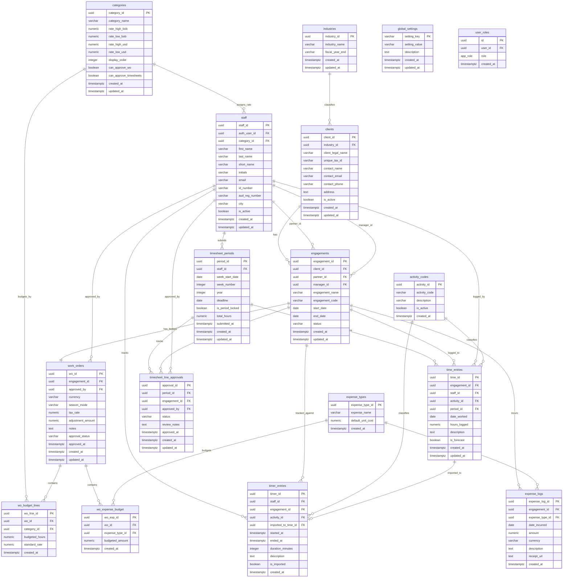

# EMS 2.0 - Engagement Management System

A comprehensive bilingual (English/Spanish) engagement management system designed for professional services firms, particularly accounting and consulting practices. Built on the Ruizmier brand identity.

   

## 🎯 Overview

EMS 2.0 manages the complete lifecycle of professional engagements from client onboarding through work order budgeting, time tracking, and expense management. The system supports multi-currency operations (USD/BOB) with seasonal rate variations.

## ✨ Key Features

### Core Modules

| Module          | Description                                                           |
| --------------- | --------------------------------------------------------------------- |
| **Dashboard**   | Overview of active engagements, hours logged, and key metrics         |
| **Clients**     | Client management with industry classification and engagement history |
| **Engagements** | Engagement lifecycle with partner/manager assignments                 |
| **Work Orders** | Budget management with multi-currency and seasonal rates              |
| **Time Entry**  | Hour logging with daily/weekly limit enforcement                      |
| **Expenses**    | Expense type configuration and expense logging                        |
| **Staff**       | Staff management with category-based roles and rates                  |
| **Settings**    | System configuration (categories, industries, activity codes)         |

### Business Logic

- **Multi-Currency Support**: USD and BOB with automatic rate selection
- **Seasonal Rates**: High and Low season rate differentiation per category
- **Realization Calculation**: Adjustment amount affects rates, preserves hours
- **Approval Workflow**: Draft → Pending Approval → Approved/Rejected
- **Time Constraints**: 10-hour daily limit, 50-hour weekly limit
- **Role-Based Approvals**: Category-level `can_approve_wo` designation

### Internationalization

- Full English and Spanish language support
- Language setting stored in Global Settings (admin-configurable)
- Date format: DD/MM/YYYY throughout

## 🏗️ Technical Architecture

### Frontend Stack

- **React 18** with TypeScript
- **Vite** for fast development and building
- **Tailwind CSS** with custom design tokens
- **shadcn/ui** component library
- **TanStack Query** for server state management
- **react-hook-form** + **Zod** for form handling
- **react-i18next** for internationalization

### Backend Stack

- **Lovable Cloud** (Supabase-powered)
- PostgreSQL database with RLS policies
- Row Level Security for data protection
- Database functions and triggers for validation

### Design System

- **Primary Teal**: #008795
- **Secondary Navy**: #0f3c73
- **Typography**: IBM Plex Sans with tabular figures
- **Density**: High-density, spreadsheet-like interfaces
- **Theme**: Corporate fintech aesthetic

### Vite Dependency Optimization

This project uses proactive dependency pre-bundling to prevent 504 Gateway Timeout errors in the Lovable sandbox environment.

#### Why This Matters

Heavy dependencies (large bundles, locale sub-modules, monorepo packages) can cause Vite's dev server to timeout during on-demand pre-bundling, resulting in blank pages and React hydration errors.

#### Pre-Bundled Dependencies

The following are explicitly included in `vite.config.ts` → `optimizeDeps.include`:

| Category            | Packages                                                                                 |
| ------------------- | ---------------------------------------------------------------------------------------- |
| Date/Time           | `date-fns`, `date-fns/locale`                                                            |
| Visualization       | `recharts`                                                                               |
| i18n                | `i18next`, `react-i18next`                                                               |
| Radix UI (Critical) | `@radix-ui/react-dialog`, `react-select`, `react-popover`, `react-tooltip`, `react-slot` |

#### Decision Rule: When to Add New Dependencies

Add a package to `optimizeDeps.include` if **ANY** of these apply:

- Package size > 500KB (check on [bundlephobia.com](https://bundlephobia.com))
- Has locale/language sub-modules (e.g., `/locale/`)
- Uses deep imports (e.g., `from 'pkg/submodule'`)
- Is a monorepo package (e.g., `@scope/*`)
- Provides CommonJS + ESM hybrid
- Previously caused loading issues

#### Debugging Symptoms

| Symptom                        | Location    | Indicates                           |
| ------------------------------ | ----------- | ----------------------------------- |
| 504/502 on `.vite/deps/*`      | Network Tab | Pre-bundling timeout                |
| `Failed to load module script` | Console     | Module resolution failure           |
| `React error #418`             | Console     | Hydration crash from missing module |
| Blank white page               | Preview     | Complete app failure                |

#### Recovery Steps

1. Add the failing dependency to `optimizeDeps.include` in `vite.config.ts`
2. Force cache rebuild (add/modify comment in config)
3. Hard refresh (`Ctrl+Shift+R` / `Cmd+Shift+R`)

## 📊 Database Schema (Updated 2512110240)

```sql
-- ============================================================================
-- EMS 2.0 - ENGAGEMENT MANAGEMENT SYSTEM
-- Complete Lovable Cloud (Supabase) Database Schema
-- Generated: 2025-12-11
-- ============================================================================

-- ============================================================================
-- ENUMS
-- ============================================================================

CREATE TYPE public.app_role AS ENUM ('admin', 'staff', 'viewer');

-- ============================================================================
-- TABLES
-- ============================================================================

-- Industries (Reference Table)
CREATE TABLE public.industries (
    industry_id UUID PRIMARY KEY DEFAULT gen_random_uuid(),
    industry_name VARCHAR(100) NOT NULL,
    fiscal_year_end VARCHAR(20) NOT NULL,
    created_at TIMESTAMPTZ DEFAULT now(),
    updated_at TIMESTAMPTZ DEFAULT now()
);
ALTER TABLE public.industries ENABLE ROW LEVEL SECURITY;

-- Categories (Staff Categories with Billing Rates)
CREATE TABLE public.categories (
    category_id UUID PRIMARY KEY DEFAULT gen_random_uuid(),
    category_name VARCHAR(50) NOT NULL,
    rate_high_bob NUMERIC(10,2) NOT NULL DEFAULT 0,
    rate_low_bob NUMERIC(10,2) NOT NULL DEFAULT 0,
    rate_high_usd NUMERIC(10,2) NOT NULL DEFAULT 0,
    rate_low_usd NUMERIC(10,2) NOT NULL DEFAULT 0,
    display_order INTEGER DEFAULT 0,
    can_approve_wo BOOLEAN DEFAULT false,
    can_approve_timesheets BOOLEAN DEFAULT false,
    created_at TIMESTAMPTZ DEFAULT now(),
    updated_at TIMESTAMPTZ DEFAULT now()
);
ALTER TABLE public.categories ENABLE ROW LEVEL SECURITY;

-- Activity Codes (Time Entry Classification)
CREATE TABLE public.activity_codes (
    activity_id UUID PRIMARY KEY DEFAULT gen_random_uuid(),
    activity_code VARCHAR(10) NOT NULL,
    description VARCHAR(100) NOT NULL,
    is_active BOOLEAN DEFAULT true,
    created_at TIMESTAMPTZ DEFAULT now()
);
ALTER TABLE public.activity_codes ENABLE ROW LEVEL SECURITY;

-- Expense Types (Expense Classification)
CREATE TABLE public.expense_types (
    expense_type_id UUID PRIMARY KEY DEFAULT gen_random_uuid(),
    expense_name VARCHAR(100) NOT NULL,
    default_unit_cost NUMERIC(10,2) DEFAULT 0,
    created_at TIMESTAMPTZ DEFAULT now()
);
ALTER TABLE public.expense_types ENABLE ROW LEVEL SECURITY;

-- Global Settings (System Configuration)
CREATE TABLE public.global_settings (
    setting_key VARCHAR(50) PRIMARY KEY,
    setting_value VARCHAR(255) NOT NULL,
    description TEXT,
    created_at TIMESTAMPTZ DEFAULT now(),
    updated_at TIMESTAMPTZ DEFAULT now()
);
ALTER TABLE public.global_settings ENABLE ROW LEVEL SECURITY;

-- User Roles (Auth User Role Assignments)
CREATE TABLE public.user_roles (
    id UUID PRIMARY KEY DEFAULT gen_random_uuid(),
    user_id UUID NOT NULL REFERENCES auth.users(id) ON DELETE CASCADE,
    role app_role NOT NULL DEFAULT 'staff',
    created_at TIMESTAMPTZ DEFAULT now()
);
ALTER TABLE public.user_roles ENABLE ROW LEVEL SECURITY;

-- Staff (Employee Records)
CREATE TABLE public.staff (
    staff_id UUID PRIMARY KEY DEFAULT gen_random_uuid(),
    first_name VARCHAR(100) NOT NULL,
    last_name VARCHAR(100) NOT NULL,
    short_name VARCHAR(50),
    initials VARCHAR(4),
    email VARCHAR(255),
    id_number VARCHAR(20),
    aud_reg_number VARCHAR(20),
    city VARCHAR(100),
    category_id UUID REFERENCES public.categories(category_id),
    auth_user_id UUID REFERENCES auth.users(id),
    is_active BOOLEAN DEFAULT true,
    created_at TIMESTAMPTZ DEFAULT now(),
    updated_at TIMESTAMPTZ DEFAULT now()
);
ALTER TABLE public.staff ENABLE ROW LEVEL SECURITY;

-- Clients
CREATE TABLE public.clients (
    client_id UUID PRIMARY KEY DEFAULT gen_random_uuid(),
    client_legal_name VARCHAR(255) NOT NULL,
    unique_tax_id VARCHAR(50) NOT NULL,
    industry_id UUID REFERENCES public.industries(industry_id),
    contact_name VARCHAR(200),
    contact_email VARCHAR(255),
    contact_phone VARCHAR(50),
    address TEXT,
    is_active BOOLEAN DEFAULT true,
    created_at TIMESTAMPTZ DEFAULT now(),
    updated_at TIMESTAMPTZ DEFAULT now()
);
ALTER TABLE public.clients ENABLE ROW LEVEL SECURITY;

-- Engagements
CREATE TABLE public.engagements (
    engagement_id UUID PRIMARY KEY DEFAULT gen_random_uuid(),
    engagement_code VARCHAR(20),
    engagement_name VARCHAR(200) NOT NULL,
    client_id UUID NOT NULL REFERENCES public.clients(client_id),
    partner_id UUID REFERENCES public.staff(staff_id),
    manager_id UUID REFERENCES public.staff(staff_id),
    start_date DATE,
    end_date DATE,
    status VARCHAR(20) DEFAULT 'active',
    created_at TIMESTAMPTZ DEFAULT now(),
    updated_at TIMESTAMPTZ DEFAULT now()
);
ALTER TABLE public.engagements ENABLE ROW LEVEL SECURITY;

-- Work Orders (Budgets - 1:1 with Engagements)
CREATE TABLE public.work_orders (
    wo_id UUID PRIMARY KEY DEFAULT gen_random_uuid(),
    engagement_id UUID NOT NULL UNIQUE REFERENCES public.engagements(engagement_id),
    currency VARCHAR(3) NOT NULL,
    season_mode VARCHAR(10) NOT NULL,
    tax_rate NUMERIC(5,4) DEFAULT 0.13,
    adjustment_amount NUMERIC(12,2) DEFAULT 0,
    notes TEXT,
    approval_status VARCHAR(20) DEFAULT 'Draft',
    approved_by UUID REFERENCES public.staff(staff_id),
    approved_at TIMESTAMPTZ,
    created_at TIMESTAMPTZ DEFAULT now(),
    updated_at TIMESTAMPTZ DEFAULT now()
);
ALTER TABLE public.work_orders ENABLE ROW LEVEL SECURITY;

-- WO Budget Lines (Hours Budget per Category)
CREATE TABLE public.wo_budget_lines (
    wo_line_id UUID PRIMARY KEY DEFAULT gen_random_uuid(),
    wo_id UUID NOT NULL REFERENCES public.work_orders(wo_id) ON DELETE CASCADE,
    category_id UUID NOT NULL REFERENCES public.categories(category_id),
    budgeted_hours NUMERIC(8,2) NOT NULL DEFAULT 0,
    standard_rate NUMERIC(10,2) NOT NULL,
    created_at TIMESTAMPTZ DEFAULT now()
);
ALTER TABLE public.wo_budget_lines ENABLE ROW LEVEL SECURITY;

-- WO Expense Budget (Expense Budget per Type)
CREATE TABLE public.wo_expense_budget (
    wo_exp_id UUID PRIMARY KEY DEFAULT gen_random_uuid(),
    wo_id UUID NOT NULL REFERENCES public.work_orders(wo_id) ON DELETE CASCADE,
    expense_type_id UUID NOT NULL REFERENCES public.expense_types(expense_type_id),
    budgeted_amount NUMERIC(12,2) NOT NULL DEFAULT 0,
    created_at TIMESTAMPTZ DEFAULT now()
);
ALTER TABLE public.wo_expense_budget ENABLE ROW LEVEL SECURITY;

-- Timesheet Periods (Weekly Timesheet Headers)
CREATE TABLE public.timesheet_periods (
    period_id UUID PRIMARY KEY DEFAULT gen_random_uuid(),
    staff_id UUID NOT NULL REFERENCES public.staff(staff_id),
    week_start_date DATE NOT NULL,
    week_number INTEGER NOT NULL,
    year INTEGER NOT NULL,
    deadline DATE,
    total_hours NUMERIC(8,2) DEFAULT 0,
    is_period_locked BOOLEAN DEFAULT false,
    submitted_at TIMESTAMPTZ,
    created_at TIMESTAMPTZ DEFAULT now(),
    updated_at TIMESTAMPTZ DEFAULT now()
);
ALTER TABLE public.timesheet_periods ENABLE ROW LEVEL SECURITY;

-- Timesheet Line Approvals (Per-Engagement Approval Status)
CREATE TABLE public.timesheet_line_approvals (
    approval_id UUID PRIMARY KEY DEFAULT gen_random_uuid(),
    period_id UUID NOT NULL REFERENCES public.timesheet_periods(period_id) ON DELETE CASCADE,
    engagement_id UUID NOT NULL REFERENCES public.engagements(engagement_id),
    status VARCHAR(20) NOT NULL DEFAULT 'pending',
    approved_by UUID REFERENCES public.staff(staff_id),
    approved_at TIMESTAMPTZ,
    review_notes TEXT,
    created_at TIMESTAMPTZ DEFAULT now(),
    updated_at TIMESTAMPTZ DEFAULT now(),
    UNIQUE (period_id, engagement_id)
);
ALTER TABLE public.timesheet_line_approvals ENABLE ROW LEVEL SECURITY;

-- Time Entries (Actual Hours Logged)
CREATE TABLE public.time_entries (
    time_id UUID PRIMARY KEY DEFAULT gen_random_uuid(),
    staff_id UUID NOT NULL REFERENCES public.staff(staff_id),
    engagement_id UUID NOT NULL REFERENCES public.engagements(engagement_id),
    activity_id UUID NOT NULL REFERENCES public.activity_codes(activity_id),
    period_id UUID REFERENCES public.timesheet_periods(period_id),
    date_worked DATE NOT NULL,
    hours_logged NUMERIC(4,2) NOT NULL,
    description TEXT,
    is_forecast BOOLEAN DEFAULT false,
    created_at TIMESTAMPTZ DEFAULT now(),
    updated_at TIMESTAMPTZ DEFAULT now()
);
ALTER TABLE public.time_entries ENABLE ROW LEVEL SECURITY;

-- Timer Entries (Real-Time Time Tracking - Staging Table)
CREATE TABLE public.timer_entries (
    timer_id UUID PRIMARY KEY DEFAULT gen_random_uuid(),
    staff_id UUID NOT NULL REFERENCES public.staff(staff_id),
    engagement_id UUID NOT NULL REFERENCES public.engagements(engagement_id),
    activity_id UUID NOT NULL REFERENCES public.activity_codes(activity_id),
    started_at TIMESTAMPTZ NOT NULL,
    ended_at TIMESTAMPTZ,
    duration_minutes INTEGER,
    description TEXT,
    is_imported BOOLEAN NOT NULL DEFAULT false,
    imported_to_time_id UUID REFERENCES public.time_entries(time_id),
    created_at TIMESTAMPTZ NOT NULL DEFAULT now()
);
ALTER TABLE public.timer_entries ENABLE ROW LEVEL SECURITY;

-- Expense Logs (Actual Expenses Incurred)
CREATE TABLE public.expense_logs (
    expense_log_id UUID PRIMARY KEY DEFAULT gen_random_uuid(),
    engagement_id UUID NOT NULL REFERENCES public.engagements(engagement_id),
    expense_type_id UUID NOT NULL REFERENCES public.expense_types(expense_type_id),
    date_incurred DATE NOT NULL,
    amount NUMERIC(12,2) NOT NULL,
    currency VARCHAR(3) DEFAULT 'BOB',
    description TEXT,
    receipt_url TEXT,
    created_at TIMESTAMPTZ DEFAULT now()
);
ALTER TABLE public.expense_logs ENABLE ROW LEVEL SECURITY;

-- ============================================================================
-- VIEWS
-- ============================================================================

CREATE OR REPLACE VIEW public.work_order_summary AS
SELECT
    wo.wo_id,
    wo.engagement_id,
    wo.currency,
    wo.season_mode,
    wo.tax_rate,
    wo.adjustment_amount,
    wo.notes,
    wo.created_at,
    wo.updated_at,
    wo.approval_status,
    wo.approved_by,
    wo.approved_at,
    COALESCE(SUM(bl.budgeted_hours * bl.standard_rate), 0) AS total_standard_fee,
    CASE
        WHEN COALESCE(SUM(bl.budgeted_hours * bl.standard_rate), 0) > 0
        THEN (COALESCE(SUM(bl.budgeted_hours * bl.standard_rate), 0) + COALESCE(wo.adjustment_amount, 0))
             / COALESCE(SUM(bl.budgeted_hours * bl.standard_rate), 0)
        ELSE 1
    END AS realization_percent,
    (COALESCE(SUM(bl.budgeted_hours * bl.standard_rate), 0) + COALESCE(wo.adjustment_amount, 0))
        / (1 - COALESCE(wo.tax_rate, 0.13)) AS fee_with_tax_gross_up
FROM work_orders wo
LEFT JOIN wo_budget_lines bl ON wo.wo_id = bl.wo_id
GROUP BY wo.wo_id;

-- ============================================================================
-- FUNCTIONS
-- ============================================================================

-- Check if staff category is auto-approved (Partners/Directors)
CREATE OR REPLACE FUNCTION public.is_auto_approved_category(p_staff_id UUID)
RETURNS BOOLEAN
LANGUAGE sql
STABLE SECURITY DEFINER
SET search_path TO 'public'
AS $$
  SELECT EXISTS (
    SELECT 1
    FROM staff s
    JOIN categories c ON s.category_id = c.category_id
    WHERE s.staff_id = p_staff_id
      AND c.display_order <= 2
  )
$$;

-- Get the designated approver for a timesheet line
CREATE OR REPLACE FUNCTION public.get_line_approver(p_staff_id UUID, p_engagement_id UUID)
RETURNS UUID
LANGUAGE plpgsql
STABLE SECURITY DEFINER
SET search_path TO 'public'
AS $$
DECLARE
  v_staff_display_order INTEGER;
  v_engagement RECORD;
BEGIN
  -- Get staff's category display_order
  SELECT c.display_order INTO v_staff_display_order
  FROM staff s
  JOIN categories c ON s.category_id = c.category_id
  WHERE s.staff_id = p_staff_id;

  -- If staff is Partner/Director (display_order <= 2), auto-approved (return NULL)
  IF v_staff_display_order IS NOT NULL AND v_staff_display_order <= 2 THEN
    RETURN NULL;
  END IF;

  -- Get engagement team
  SELECT manager_id, partner_id INTO v_engagement
  FROM engagements
  WHERE engagement_id = p_engagement_id;

  -- If staff is Manager (display_order 3-4), return partner_id
  IF v_staff_display_order IS NOT NULL AND v_staff_display_order <= 4 THEN
    RETURN v_engagement.partner_id;
  END IF;

  -- Otherwise (Staff/Junior/Senior), return manager_id first, fallback to partner_id
  IF v_engagement.manager_id IS NOT NULL THEN
    RETURN v_engagement.manager_id;
  END IF;

  RETURN v_engagement.partner_id;
END;
$$;

-- Get all valid approvers for a staff member's timesheet week
CREATE OR REPLACE FUNCTION public.get_timesheet_approvers(p_staff_id UUID, p_week_start DATE)
RETURNS TABLE(approver_staff_id UUID)
LANGUAGE plpgsql
STABLE SECURITY DEFINER
SET search_path TO 'public'
AS $$
DECLARE
  v_submitter_display_order INTEGER;
BEGIN
  -- Get the submitter's display_order
  SELECT c.display_order INTO v_submitter_display_order
  FROM staff s
  JOIN categories c ON s.category_id = c.category_id
  WHERE s.staff_id = p_staff_id;

  -- If submitter has no category or display_order, return empty
  IF v_submitter_display_order IS NULL THEN
    RETURN;
  END IF;

  -- Return approvers from engagements where staff logged time that week
  -- Approvers must have LOWER display_order (higher rank) and not be self
  RETURN QUERY
  SELECT DISTINCT potential_approver.staff_id
  FROM (
    -- Get manager_id from engagements where staff logged time
    SELECT e.manager_id AS staff_id
    FROM time_entries te
    JOIN engagements e ON te.engagement_id = e.engagement_id
    WHERE te.staff_id = p_staff_id
      AND te.date_worked >= p_week_start
      AND te.date_worked < p_week_start + INTERVAL '7 days'
      AND e.manager_id IS NOT NULL

    UNION

    -- Get partner_id from engagements where staff logged time
    SELECT e.partner_id AS staff_id
    FROM time_entries te
    JOIN engagements e ON te.engagement_id = e.engagement_id
    WHERE te.staff_id = p_staff_id
      AND te.date_worked >= p_week_start
      AND te.date_worked < p_week_start + INTERVAL '7 days'
      AND e.partner_id IS NOT NULL
  ) potential_approver
  JOIN staff approver_s ON potential_approver.staff_id = approver_s.staff_id
  JOIN categories approver_c ON approver_s.category_id = approver_c.category_id
  WHERE potential_approver.staff_id != p_staff_id  -- No self-approval
    AND approver_c.display_order < v_submitter_display_order  -- Must be higher rank
    AND approver_c.can_approve_timesheets = true;  -- Must have permission
END;
$$;

-- Check if user can approve a specific timesheet period
CREATE OR REPLACE FUNCTION public.can_approve_timesheet(p_approver_auth_id UUID, p_period_id UUID)
RETURNS BOOLEAN
LANGUAGE plpgsql
STABLE SECURITY DEFINER
SET search_path TO 'public'
AS $$
DECLARE
  v_period RECORD;
  v_approver_staff_id UUID;
BEGIN
  -- Get the approver's staff_id
  SELECT staff_id INTO v_approver_staff_id
  FROM staff
  WHERE auth_user_id = p_approver_auth_id;

  IF v_approver_staff_id IS NULL THEN
    RETURN false;
  END IF;

  -- Get the period details
  SELECT tp.staff_id, tp.week_start_date
  INTO v_period
  FROM timesheet_periods tp
  WHERE tp.period_id = p_period_id;

  IF v_period IS NULL THEN
    RETURN false;
  END IF;

  -- Check if the approver is in the list of valid approvers
  RETURN EXISTS (
    SELECT 1
    FROM get_timesheet_approvers(v_period.staff_id, v_period.week_start_date) gta
    WHERE gta.approver_staff_id = v_approver_staff_id
  );
END;
$$;

-- Check if user can approve a specific timesheet line (per engagement)
CREATE OR REPLACE FUNCTION public.can_approve_timesheet_line(p_approver_auth_id UUID, p_period_id UUID, p_engagement_id UUID)
RETURNS BOOLEAN
LANGUAGE plpgsql
STABLE SECURITY DEFINER
SET search_path TO 'public'
AS $$
DECLARE
  v_approver_staff_id UUID;
  v_period_staff_id UUID;
  v_expected_approver UUID;
  v_approver_display_order INTEGER;
BEGIN
  -- Get approver's staff_id
  SELECT staff_id INTO v_approver_staff_id
  FROM staff
  WHERE auth_user_id = p_approver_auth_id;

  IF v_approver_staff_id IS NULL THEN
    RETURN FALSE;
  END IF;

  -- Get approver's category display_order and check can_approve_timesheets
  SELECT c.display_order INTO v_approver_display_order
  FROM staff s
  JOIN categories c ON s.category_id = c.category_id
  WHERE s.staff_id = v_approver_staff_id
    AND c.can_approve_timesheets = TRUE;

  IF v_approver_display_order IS NULL THEN
    RETURN FALSE;
  END IF;

  -- Get the period's staff_id
  SELECT staff_id INTO v_period_staff_id
  FROM timesheet_periods
  WHERE period_id = p_period_id;

  IF v_period_staff_id IS NULL THEN
    RETURN FALSE;
  END IF;

  -- Prevent self-approval
  IF v_approver_staff_id = v_period_staff_id THEN
    RETURN FALSE;
  END IF;

  -- Get expected approver for this line
  v_expected_approver := get_line_approver(v_period_staff_id, p_engagement_id);

  -- If auto-approved (NULL), no one should approve
  IF v_expected_approver IS NULL THEN
    RETURN FALSE;
  END IF;

  -- Check if this approver matches the expected approver
  -- OR if approver is higher ranked (partner can approve manager's team)
  RETURN v_approver_staff_id = v_expected_approver
    OR v_approver_display_order < (
      SELECT c.display_order
      FROM staff s
      JOIN categories c ON s.category_id = c.category_id
      WHERE s.staff_id = v_expected_approver
    );
END;
$$;

-- Check if user has a specific role
CREATE OR REPLACE FUNCTION public.has_role(_user_id UUID, _role app_role)
RETURNS BOOLEAN
LANGUAGE sql
STABLE SECURITY DEFINER
SET search_path TO 'public'
AS $$
  SELECT EXISTS (
    SELECT 1
    FROM public.user_roles
    WHERE user_id = _user_id
      AND role = _role
  )
$$;

-- Handle new user registration (assign default role)
CREATE OR REPLACE FUNCTION public.handle_new_user()
RETURNS TRIGGER
LANGUAGE plpgsql
SECURITY DEFINER
SET search_path TO 'public'
AS $$
BEGIN
  INSERT INTO public.user_roles (user_id, role)
  VALUES (NEW.id, 'staff');
  RETURN NEW;
END;
$$;

-- Auto-link auth user to staff record by email
CREATE OR REPLACE FUNCTION public.link_auth_user_to_staff()
RETURNS TRIGGER
LANGUAGE plpgsql
SECURITY DEFINER
SET search_path TO 'public'
AS $$
BEGIN
  -- Update staff record if email matches
  UPDATE public.staff
  SET auth_user_id = NEW.id,
      updated_at = now()
  WHERE email = NEW.email
    AND auth_user_id IS NULL;

  RETURN NEW;
END;
$$;

-- Auto-update updated_at column
CREATE OR REPLACE FUNCTION public.update_updated_at_column()
RETURNS TRIGGER
LANGUAGE plpgsql
SET search_path TO 'public'
AS $$
BEGIN
  NEW.updated_at = NOW();
  RETURN NEW;
END;
$$;

-- Check Work Order is approved before time entry
CREATE OR REPLACE FUNCTION public.check_wo_approved()
RETURNS TRIGGER
LANGUAGE plpgsql
SECURITY DEFINER
SET search_path TO 'public'
AS $$
BEGIN
  IF NOT EXISTS (
    SELECT 1 FROM work_orders wo
    WHERE wo.engagement_id = NEW.engagement_id
    AND wo.approval_status = 'Approved'
  ) THEN
    RAISE EXCEPTION 'Cannot log time: Work Order is not approved';
  END IF;
  RETURN NEW;
END;
$$;

-- ============================================================================
-- TRIGGERS (Applied via auth.users - managed by Supabase)
-- ============================================================================

-- Note: These triggers are created on auth.users table (managed by Supabase):
-- 1. on_auth_user_created -> handle_new_user() - Assigns 'staff' role to new users
-- 2. on_auth_user_created -> link_auth_user_to_staff() - Links auth user to staff by email

-- Trigger on time_entries to enforce Work Order approval
CREATE TRIGGER check_wo_approved_trigger
  BEFORE INSERT ON public.time_entries
  FOR EACH ROW
  EXECUTE FUNCTION public.check_wo_approved();

-- ============================================================================
-- ROW LEVEL SECURITY (RLS) POLICIES
-- ============================================================================

-- activity_codes
CREATE POLICY "Authenticated users can read activities" ON public.activity_codes
  FOR SELECT TO authenticated USING (true);
CREATE POLICY "Authenticated users can manage activities" ON public.activity_codes
  FOR ALL TO authenticated USING (true) WITH CHECK (true);

-- categories
CREATE POLICY "Authenticated users can read categories" ON public.categories
  FOR SELECT TO authenticated USING (true);
CREATE POLICY "Authenticated users can manage categories" ON public.categories
  FOR ALL TO authenticated USING (true) WITH CHECK (true);

-- clients
CREATE POLICY "Authenticated users can read clients" ON public.clients
  FOR SELECT TO authenticated USING (true);
CREATE POLICY "Authenticated users can manage clients" ON public.clients
  FOR ALL TO authenticated USING (true) WITH CHECK (true);

-- engagements
CREATE POLICY "Authenticated users can read engagements" ON public.engagements
  FOR SELECT TO authenticated USING (true);
CREATE POLICY "Authenticated users can manage engagements" ON public.engagements
  FOR ALL TO authenticated USING (true) WITH CHECK (true);

-- expense_logs
CREATE POLICY "Authenticated users can read expense logs" ON public.expense_logs
  FOR SELECT TO authenticated USING (true);
CREATE POLICY "Authenticated users can manage expense logs" ON public.expense_logs
  FOR ALL TO authenticated USING (true) WITH CHECK (true);

-- expense_types
CREATE POLICY "Authenticated users can read expense types" ON public.expense_types
  FOR SELECT TO authenticated USING (true);
CREATE POLICY "Authenticated users can manage expense types" ON public.expense_types
  FOR ALL TO authenticated USING (true) WITH CHECK (true);

-- global_settings
CREATE POLICY "Authenticated users can read settings" ON public.global_settings
  FOR SELECT TO authenticated USING (true);
CREATE POLICY "Authenticated users can manage settings" ON public.global_settings
  FOR ALL TO authenticated USING (true) WITH CHECK (true);

-- industries
CREATE POLICY "Authenticated users can read industries" ON public.industries
  FOR SELECT TO authenticated USING (true);
CREATE POLICY "Authenticated users can manage industries" ON public.industries
  FOR ALL TO authenticated USING (true) WITH CHECK (true);

-- staff
CREATE POLICY "Authenticated users can read staff" ON public.staff
  FOR SELECT TO authenticated USING (true);
CREATE POLICY "Authenticated users can manage staff" ON public.staff
  FOR ALL TO authenticated USING (true) WITH CHECK (true);
CREATE POLICY "Users can view their linked staff record" ON public.staff
  FOR SELECT USING (auth_user_id = auth.uid());
CREATE POLICY "Users can update their linked staff record" ON public.staff
  FOR UPDATE USING (auth_user_id = auth.uid()) WITH CHECK (auth_user_id = auth.uid());

-- time_entries
CREATE POLICY "Authenticated users can read time entries" ON public.time_entries
  FOR SELECT TO authenticated USING (true);
CREATE POLICY "Authenticated users can manage time entries" ON public.time_entries
  FOR ALL TO authenticated USING (true) WITH CHECK (true);

-- timer_entries (Staff can only access their own)
CREATE POLICY "Staff can view own timer entries" ON public.timer_entries
  FOR SELECT USING (staff_id IN (SELECT s.staff_id FROM staff s WHERE s.auth_user_id = auth.uid()));
CREATE POLICY "Staff can create own timer entries" ON public.timer_entries
  FOR INSERT WITH CHECK (staff_id IN (SELECT s.staff_id FROM staff s WHERE s.auth_user_id = auth.uid()));
CREATE POLICY "Staff can update own timer entries" ON public.timer_entries
  FOR UPDATE USING (staff_id IN (SELECT s.staff_id FROM staff s WHERE s.auth_user_id = auth.uid()));
CREATE POLICY "Staff can delete own timer entries" ON public.timer_entries
  FOR DELETE USING (staff_id IN (SELECT s.staff_id FROM staff s WHERE s.auth_user_id = auth.uid()));

-- timesheet_periods
CREATE POLICY "Staff can view own periods" ON public.timesheet_periods
  FOR SELECT USING (staff_id IN (SELECT s.staff_id FROM staff s WHERE s.auth_user_id = auth.uid()));
CREATE POLICY "Staff can create own periods" ON public.timesheet_periods
  FOR INSERT WITH CHECK (staff_id IN (SELECT s.staff_id FROM staff s WHERE s.auth_user_id = auth.uid()));
CREATE POLICY "Staff can update own unlocked periods" ON public.timesheet_periods
  FOR UPDATE USING (staff_id IN (SELECT s.staff_id FROM staff s WHERE s.auth_user_id = auth.uid()) AND is_period_locked = false);
CREATE POLICY "Approvers can view all periods" ON public.timesheet_periods
  FOR SELECT USING (EXISTS (
    SELECT 1 FROM staff s JOIN categories c ON s.category_id = c.category_id
    WHERE s.auth_user_id = auth.uid() AND c.can_approve_wo = true
  ));
CREATE POLICY "Approvers can view assigned timesheets" ON public.timesheet_periods
  FOR SELECT USING (can_approve_timesheet(auth.uid(), period_id));
CREATE POLICY "Approvers can update all periods" ON public.timesheet_periods
  FOR UPDATE USING (EXISTS (
    SELECT 1 FROM staff s JOIN categories c ON s.category_id = c.category_id
    WHERE s.auth_user_id = auth.uid() AND c.can_approve_wo = true
  ));
CREATE POLICY "Approvers can update assigned timesheets" ON public.timesheet_periods
  FOR UPDATE USING (can_approve_timesheet(auth.uid(), period_id));

-- timesheet_line_approvals
CREATE POLICY "Staff can view own line approvals" ON public.timesheet_line_approvals
  FOR SELECT USING (period_id IN (
    SELECT tp.period_id FROM timesheet_periods tp JOIN staff s ON tp.staff_id = s.staff_id
    WHERE s.auth_user_id = auth.uid()
  ));
CREATE POLICY "Staff can create own line approvals" ON public.timesheet_line_approvals
  FOR INSERT WITH CHECK (period_id IN (
    SELECT tp.period_id FROM timesheet_periods tp JOIN staff s ON tp.staff_id = s.staff_id
    WHERE s.auth_user_id = auth.uid()
  ));
CREATE POLICY "Approvers can view assigned line approvals" ON public.timesheet_line_approvals
  FOR SELECT USING (can_approve_timesheet_line(auth.uid(), period_id, engagement_id));
CREATE POLICY "Approvers can update assigned line approvals" ON public.timesheet_line_approvals
  FOR UPDATE USING (can_approve_timesheet_line(auth.uid(), period_id, engagement_id));
CREATE POLICY "Leadership can view all line approvals" ON public.timesheet_line_approvals
  FOR SELECT USING (EXISTS (
    SELECT 1 FROM staff s JOIN categories c ON s.category_id = c.category_id
    WHERE s.auth_user_id = auth.uid() AND c.display_order <= 2
  ));

-- user_roles
CREATE POLICY "Users can view their own roles" ON public.user_roles
  FOR SELECT USING (auth.uid() = user_id);
CREATE POLICY "Admins can manage all roles" ON public.user_roles
  FOR ALL USING (has_role(auth.uid(), 'admin')) WITH CHECK (has_role(auth.uid(), 'admin'));

-- wo_budget_lines
CREATE POLICY "Authenticated users can read budget lines" ON public.wo_budget_lines
  FOR SELECT TO authenticated USING (true);
CREATE POLICY "Authenticated users can manage budget lines" ON public.wo_budget_lines
  FOR ALL TO authenticated USING (true) WITH CHECK (true);

-- wo_expense_budget
CREATE POLICY "Authenticated users can read expense budget" ON public.wo_expense_budget
  FOR SELECT TO authenticated USING (true);
CREATE POLICY "Authenticated users can manage expense budget" ON public.wo_expense_budget
  FOR ALL TO authenticated USING (true) WITH CHECK (true);

-- work_orders
CREATE POLICY "Authenticated users can read work orders" ON public.work_orders
  FOR SELECT TO authenticated USING (true);
CREATE POLICY "Authenticated users can manage work orders" ON public.work_orders
  FOR ALL TO authenticated USING (true) WITH CHECK (true);

-- ============================================================================
-- END OF SCHEMA
-- ============================================================================


```

⸻

## 📊 Database Table Summary

| Table                      | Purpose                                                 | Key Relationships                                               |
| -------------------------- | ------------------------------------------------------- | --------------------------------------------------------------- |
| `industries`               | Client industry classification                          | → `clients`                                                     |
| `categories`               | Staff categories with billing rates                     | → `staff`, `wo_budget_lines`                                    |
| `activity_codes`           | Time entry classification codes                         | → `time_entries`, `timer_entries`                               |
| `expense_types`            | Expense classification                                  | → `expense_logs`, `wo_expense_budget`                           |
| `global_settings`          | System configuration values (`TAX_RATE`, etc.)          | None                                                            |
| `user_roles`               | Authentication roles (`admin`, `staff`, `viewer`)       | → `auth.users`                                                  |
| `staff`                    | Employee records                                        | → `categories`, `auth.users`                                    |
| `clients`                  | Client companies                                        | → `industries`                                                  |
| `engagements`              | Projects / Jobs                                         | → `clients`, `staff` (partner, manager)                         |
| `work_orders`              | Engagement pricing & budget (strict 1:1 per engagement) | → `engagements`, `staff` (approver)                             |
| `wo_budget_lines`          | Hours budget by category                                | → `work_orders`, `categories`                                   |
| `wo_expense_budget`        | Expense budget allocations                              | → `work_orders`, `expense_types`                                |
| `timesheet_periods`        | Weekly timesheet headers (submission status)            | → `staff`                                                       |
| `timesheet_line_approvals` | Per-engagement approval status within a period          | → `timesheet_periods`, `engagements`, `staff` (approver)        |
| `time_entries`             | Actual hours logged                                     | → `engagements`, `staff`, `activity_codes`, `timesheet_periods` |
| `timer_entries`            | Real-time stopwatch staging table                       | → `staff`, `engagements`, `activity_codes`, `time_entries`      |
| `expense_logs`             | Expenses incurred by engagement                         | → `engagements`, `expense_types`                                |

### 🎯 Notes

#### 🔗 Work Order Structure

- `work_orders` enforce a strict **1:1 relationship with engagements**, functioning like a **pricing & budget sheet**

#### 👥 Staff Relationships

Staff has multiple functional relationships:

- Associated with **categories** (rate group)
- Linked to **Supabase \`auth.users\`**
- Assigned as **partner/manager in engagements**

#### 📌 Supported Business Logic

This schema supports:

- Seasonality-based pricing
- Multi-currency budget planning (**BOB/USD**)
- Category-level time budgeting
- Expense forecasting

⸻

## 📊 Entity Relationship Diagram



### Diagram Notes

| Symbol       | Meaning                                      |
| ------------ | -------------------------------------------- |
| `\|\|--\|\|` | One-to-One (e.g., engagement ↔ work_order)  |
| `\|\|--o{`   | One-to-Many (e.g., client → engagements)     |
| `o\|`        | Zero-or-One (e.g., timer_entry → time_entry) |
| `PK`         | Primary Key                                  |
| `FK`         | Foreign Key                                  |

## More Stuff
