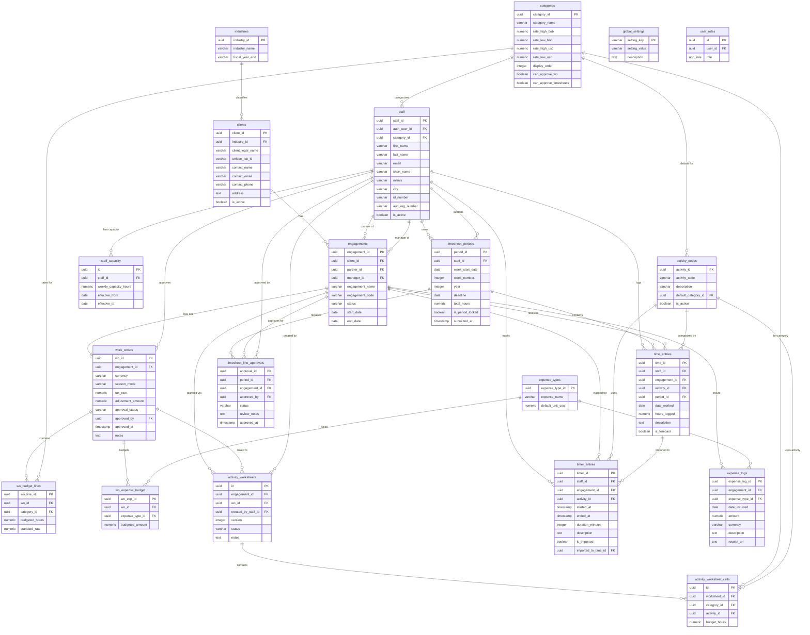

# EMS 2.0 Entity Relationship Diagram

Database schema for the Engagement Management System.

**Last Updated:** 2026-01-13

---

---

## Computed Views

| View | Purpose |
|------|---------|
| `clients_directory` | Public client info (excludes sensitive data) |
| `staff_directory` | Public staff info (excludes auth/PII) |
| `work_order_summary` | Aggregated WO with calculated fees |
| `vw_wo_budget_hours_by_category` | Budget hours rolled up by category |
| `vw_wo_budget_hours_by_category_activity` | Budget hours by category + activity |
| `vw_actual_hours_by_category_activity` | Actual logged hours by category + activity |
| `vw_budget_vs_actual_hours_by_category_activity` | Variance analysis view |

---

## Key Business Rules

1. **1:1 Engagement ↔ Work Order** — Each engagement has exactly one work order
2. **Rate Locking** — WO budget lines snapshot rates at creation time
3. **Fiscal Year** — Runs Oct 1 → Sep 30 (configured in `fiscalCalculations.ts`)
4. **VAT/IVA** — Always 13% (`tax_rate` default)
5. **Timesheet Approval** — Line-level approval per engagement per period
